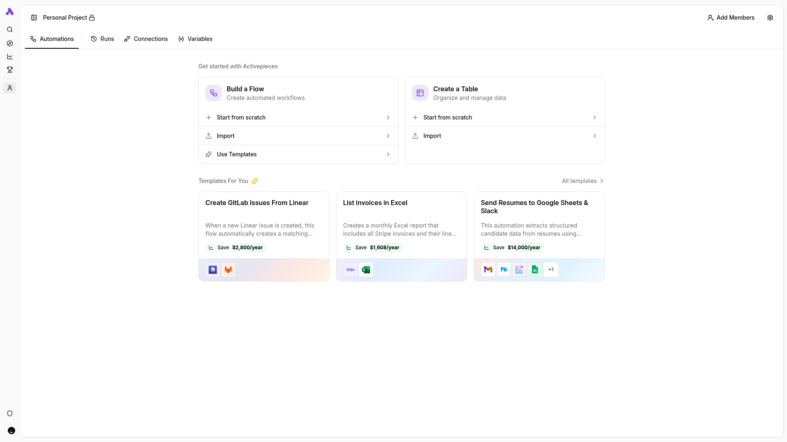

# Activepieces

Open-source no-code workflow automation platform (Zapier alternative) with
hundreds of app connectors ("pieces") and built-in MCP support — flows and
pieces can be exposed as MCP tools for AI agents. Runs as a single app
container (UI + API + worker) backed by PostgreSQL and Redis.

This stack runs with `AP_EXECUTION_MODE=UNSANDBOXED`, required because the
container is not privileged — flow code executes without the isolated sandbox,
which is fine for local single-user use only.



## Usage

```bash
make docker-up
```

Open http://localhost:8081 — first boot runs DB migrations (give it a minute),
then shows the **sign-up form**: enter name, email, and password to create the
admin account and land on the Flows dashboard.

## Services

| Container | Port(s) | Description |
|-----------|---------|-------------|
| **activepieces** | `8081` → 80 | App server — web UI, REST API, and flow worker in one container |
| **postgres** | — | PostgreSQL 16 (pgvector build, per upstream) storing flows, users, runs |
| **redis** | — | Redis 7 queue/cache for flow executions |

## Configuration

Environment variables in `docker-compose.yml` (sandbox-safe defaults):

| Variable | Default | Notes |
|----------|---------|-------|
| `AP_ENCRYPTION_KEY` | `017ff4b1…` | 32-hex-char key encrypting stored credentials — **sandbox-only, regenerate** (`openssl rand -hex 16`) |
| `AP_JWT_SECRET` | `555f1143…` | JWT signing secret — **sandbox-only, regenerate** (`openssl rand -hex 32`) |
| `AP_FRONTEND_URL` | `http://localhost:8081` | Public URL the browser uses; must match the published port |
| `AP_EXECUTION_MODE` | `UNSANDBOXED` | Required when not running privileged; do not expose publicly in this mode |
| `AP_POSTGRES_*` | `postgres` / `activepieces` | DB host, port, database, user, password — **sandbox-only credentials** |
| `AP_REDIS_HOST` / `AP_REDIS_PORT` | `redis` / `6379` | Queue backend |
| `AP_TELEMETRY_ENABLED` | `false` | Disable usage telemetry |

## Volumes

| Path | Contents |
|------|----------|
| `.docker/cache/` | Activepieces engine/pieces cache (`/usr/src/app/cache`) |
| `.docker/postgres/` | PostgreSQL data — flows, users, connections, runs |
| `.docker/redis/` | Redis persistence (execution queue) |

## Observability

| Check | Endpoint / Command |
|-------|--------------------|
| API flags | `curl http://localhost:8081/api/v1/flags` |
| UI | `curl -sI http://localhost:8081/` |
| Postgres | `docker compose exec postgres pg_isready -U activepieces` |
| Redis | `docker compose exec redis redis-cli ping` |
| Logs | `docker compose logs -f activepieces` |

## Resources

- GitHub: https://github.com/activepieces/activepieces
- Docs: https://www.activepieces.com/docs
- MCP: https://www.activepieces.com/docs/ai/mcp
