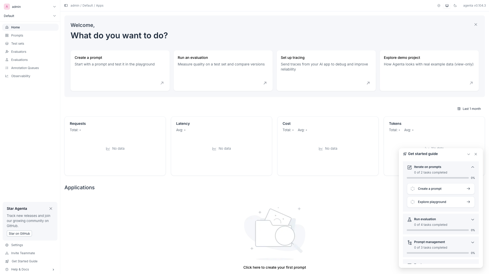

# Agenta

Open-source LLM engineering platform — prompt playground, side-by-side testing, evaluations, tracing, and datasets. Purpose-built for iterating on LLM applications with human and automated evals.



## Usage

```bash
make docker-up
```

Open http://localhost:8081 and create an account on first visit.

> First startup runs database migrations (the one-time `alembic` init container) before the API comes up. Allow 1–2 minutes for all services to become ready. The web entrypoint bakes the **public** URL (`AGENTA_API_URL`, default `http://localhost:8081/api`) into a browser-loaded `/__env.js`; if you change `AGENTA_PORT`, update these public URL vars too or browser auth will fail.

<details>
<summary>SDK integration</summary>

**Python:**
```python
pip install agenta
import agenta as ag

ag.init(
    host="http://localhost:8081",
    app_name="my-app",
)

@ag.instrument()
def my_llm_call(prompt: str) -> str:
    # your LLM call here
    return response
```

**LangChain:**
```python
from agenta.sdk.tracing.integrations.langchain import AgentaCallbackHandler

handler = AgentaCallbackHandler()
chain.invoke({"input": "..."}, config={"callbacks": [handler]})
```
</details>

## Services

| Container | Port(s) | Description |
|-----------|---------|-------------|
| **traefik** | `8081` (UI via `/`), `127.0.0.1:8082` (dashboard) | Reverse proxy routing `/api`, `/services`, `/` paths |
| **web** | — | Next.js web UI (served through Traefik) |
| **api** | — | FastAPI/Gunicorn backend (routes via `/api`) |
| **services** | — | Additional services layer (routes via `/services`) |
| **alembic** | — | One-time database migration runner (init container) |
| **worker-evaluations** | — | Celery worker — evaluation jobs |
| **worker-tracing** | — | Celery worker — trace processing |
| **worker-webhooks** | — | Celery worker — webhook delivery |
| **worker-events** | — | Celery worker — event processing |
| **cron** | — | Scheduled jobs (supercronic) |
| **supertokens** | — | Auth service (SuperTokens + PostgreSQL) |
| **postgres** | — | PostgreSQL 17 (agenta + supertokens databases) |
| **redis-volatile** | — | Redis (LRU eviction) — Celery broker + cache |
| **redis-durable** | `127.0.0.1:6381` | Redis (AOF persistence) — Celery results |

## Configuration

Environment variables in `.env` (sandbox-safe defaults):

| Variable | Default | Notes |
|----------|---------|-------|
| `AGENTA_AUTH_KEY` | `changeme-auth-key-32-chars-minimum` | Auth signing key — **change** for real use |
| `AGENTA_CRYPT_KEY` | `changeme-crypt-key-32-chars-min` | Encryption key — **change** for real use |
| `POSTGRES_USER` | `agenta` | PostgreSQL user |
| `POSTGRES_PASSWORD` | `agenta` | PostgreSQL password — **change** for real use |
| `AGENTA_PORT` | `8081` | External port for the UI (via Traefik) |

Generate secure keys with `openssl rand -hex 32`.

## Volumes

| Path | Contents |
|------|----------|
| `.docker/postgres/` | PostgreSQL data (agenta + supertokens) |
| `.docker/redis-volatile/` | Redis broker/cache state |
| `.docker/redis-durable/` | Redis (AOF) Celery results |

## Observability

| Check | Endpoint / Command |
|-------|--------------------|
| Traefik dashboard | `http://localhost:8082` (localhost-only) |
| Service health | `docker compose ps` (postgres/redis have Compose healthchecks) |
| Logs | `docker compose logs -f api` |

## Resources

- GitHub: https://github.com/agenta-ai/agenta
- Docs: https://docs.agenta.ai
