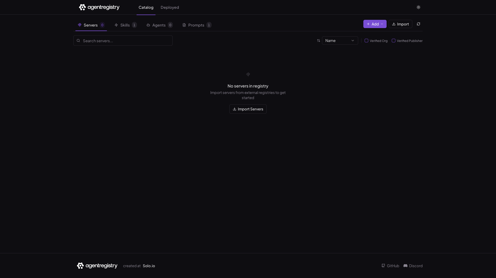

# agentregistry

One registry for MCP servers, agents, skills, and prompts — an open-source (Apache 2.0) platform to publish, curate, discover, and deploy AI building blocks from a single catalog with a web UI, REST API, and the `arctl` CLI.

This stack reproduces the upstream local (`docker` platform-mode) deployment: the Go server plus a bundled PostgreSQL. The server manages deployed MCP/agent containers on the host via the mounted Docker socket.



## Usage

```bash
make docker-up
```

Open http://localhost:12121 for the web UI; the REST API is under `http://localhost:12121/v0`. The MCP endpoint is exposed on port `31313`.

To drive it from the CLI, install `arctl`:

```bash
curl -fsSL https://raw.githubusercontent.com/agentregistry-dev/agentregistry/main/scripts/get-arctl | bash
```

> **Docker socket = host-root-equivalent.** The server mounts `/var/run/docker.sock` (read-write) so it can launch MCP/agent containers on the host — treat it as full host access. It also mounts `/tmp` to share configs with those containers.
>
> Upstream normally starts this same stack via `arctl daemon start` (which manages its own Compose project) and additionally mounts `~/.kube/config` for a local Kubernetes path; that k8s plumbing is omitted here to keep the stack self-contained. Upstream publishes versioned tags only (no `latest`), so the image is pinned to `v0.3.3` — bump `VERSION` in `.env` to upgrade.

## Services

| Container | Port(s) | Description |
|-----------|---------|-------------|
| **agentregistry** | `12121` (UI/API), `31313` (MCP) | Registry server — web UI, REST API (`/v0`), and MCP endpoint |
| **postgres** | `127.0.0.1:5432` | PostgreSQL 16 backing store for registry metadata |

## Configuration

Environment variables in `.env` (sandbox-safe defaults):

| Variable | Default | Notes |
|----------|---------|-------|
| `DOCKER_REGISTRY` | `ghcr.io` | Registry hosting the server image |
| `VERSION` | `v0.3.3` | Server image tag (upstream publishes no `latest`) |
| `POSTGRES_DB` | `agentregistry` | PostgreSQL database name |
| `POSTGRES_USER` | `agentregistry` | PostgreSQL user |
| `POSTGRES_PASSWORD` | `agentregistry` | PostgreSQL password — **change** for real use |
| `AGENT_REGISTRY_JWT_PRIVATE_KEY` | all-zeros | JWT signing key — **change** for real use (`openssl rand -hex 32`) |

## Volumes

| Path | Contents |
|------|----------|
| `.docker/postgres/` | PostgreSQL data (registry metadata) |

## Observability

| Check | Endpoint / Command |
|-------|--------------------|
| Health | `curl http://localhost:12121/` (Compose healthcheck probes the same) |
| Logs | `docker compose logs -f agentregistry` |

## Resources

- GitHub: https://github.com/agentregistry-dev/agentregistry
