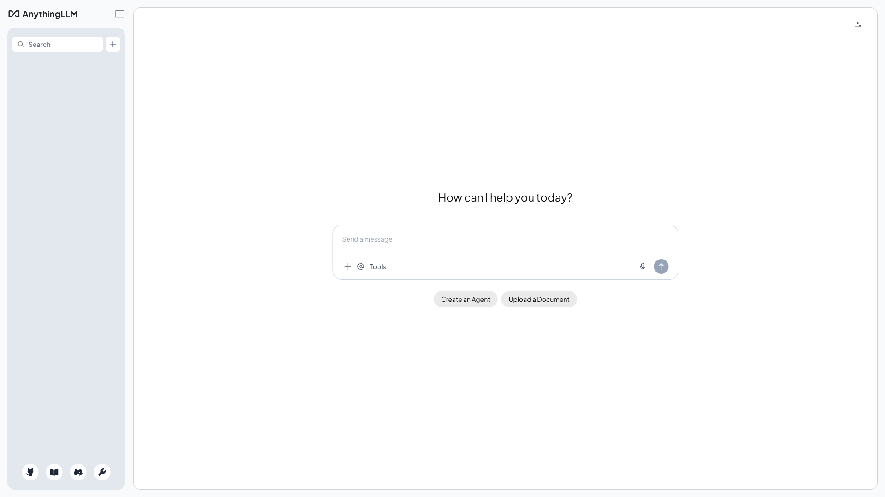

# AnythingLLM

Document-aware AI chat with RAG (Retrieval-Augmented Generation). Upload documents, create workspaces, and chat with your data using any LLM provider, backed by a built-in vector database.



## Usage

```bash
make docker-up
```

Open http://localhost:3001. First run launches the **onboarding wizard**: pick an LLM provider (and enter its API key), accept the embedding / vector-DB defaults (native embeddings + LanceDB), create a workspace, then land in the workspace chat. Upload documents to a workspace to chat over them (RAG).

> The LLM provider is left unset in `.env` — either uncomment `LLM_PROVIDER` plus its API key there, or configure it entirely from the onboarding wizard / Settings.

## Services

| Container | Port(s) | Description |
|-----------|---------|-------------|
| **anythingllm** | `3001` | AnythingLLM application with built-in vector database (LanceDB) |

## Configuration

Environment variables in `.env` (sandbox-safe defaults):

| Variable | Default | Notes |
|----------|---------|-------|
| `LLM_PROVIDER` | *(unset)* | LLM backend (`openai`, `anthropic`, …); set with its API key or via the wizard |
| `OPENAI_API_KEY` | *(unset)* | Provider API key — **change** for real use |
| `EMBEDDING_ENGINE` | `native` | Embedding provider |
| `VECTOR_DB` | `lancedb` | Vector store |

## Volumes

| Path | Contents |
|------|----------|
| `.docker/storage/` | Workspaces, vectors, uploaded documents |

## Observability

| Check | Endpoint / Command |
|-------|--------------------|
| Logs | `docker compose logs -f anythingllm` |

## Resources

- GitHub: https://github.com/Mintplex-Labs/anything-llm
- Docs: https://docs.anythingllm.com
