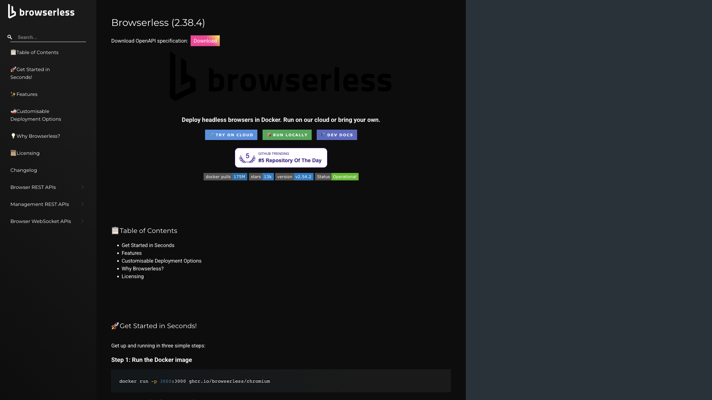

# Browserless

Headless Chromium API for browser automation, screenshots, PDF generation, and scraping. Exposes an HTTP API plus an interactive docs UI and live session debugger.



## Usage

```bash
make docker-up
```

Reach it at:

- **API / docs UI**: http://localhost:3000/docs — interactive docs + OpenAPI reference
- **Live debugger**: http://localhost:3000/debugger/ — interactive session debugger
- **Version probe**: http://localhost:3000/json/version

> No token is configured (`BROWSERLESS_TOKEN` is commented out), so the server runs open — `GET /config` reports `"token": null` and no `?token=` param is required. Set `BROWSERLESS_TOKEN` to lock it down. The root path `/` returns 404; the UI lives at `/docs` and `/debugger/`. Host port `3000` is shared with several other ysandbox stacks — run only one at a time, or remap it via a gitignored `docker-compose.override.yml`.

<details>
<summary>API examples</summary>

Take a screenshot:

```bash
curl -X POST http://localhost:3000/screenshot \
    -H "Content-Type: application/json" \
    -d '{"url": "https://example.com"}' -o screenshot.png
```

Generate a PDF:

```bash
curl -X POST http://localhost:3000/pdf \
    -H "Content-Type: application/json" \
    -d '{"url": "https://example.com"}' -o page.pdf
```
</details>

## Services

| Container | Port(s) | Description |
|-----------|---------|-------------|
| **browserless** | `3000` | Browserless Chromium server (API, docs UI, debugger) |

## Configuration

Environment variables in `docker-compose.yml`:

| Variable | Default | Notes |
|----------|---------|-------|
| `CONCURRENT` | `3` | Max concurrent browser sessions |
| `TIMEOUT` | `30000` | Session timeout (ms) |
| `BROWSERLESS_TOKEN` | *(unset)* | Optional API token — set to require auth |

## Volumes

None — stateless.

## Observability

| Check | Endpoint / Command |
|-------|--------------------|
| Version | `curl http://localhost:3000/json/version` |
| Config | `curl http://localhost:3000/config` |
| Logs | `docker compose logs -f browserless` |

## Resources

- GitHub: https://github.com/browserless/browserless
- Docs: https://docs.browserless.io
