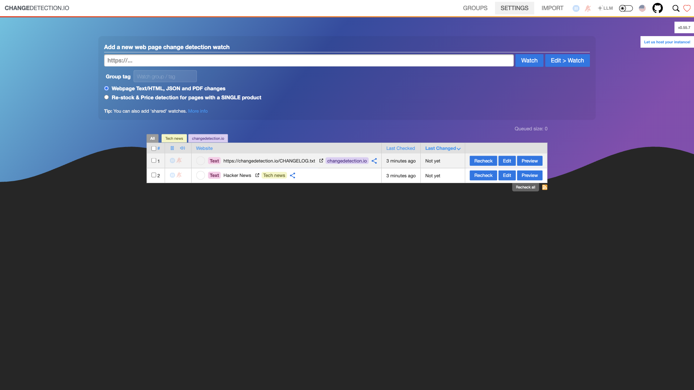

# ChangeDetection.io

Website change monitoring and notification service. Track changes on any website and get alerted when content changes.



## Usage

```bash
make docker-up
```

Open http://localhost:5000, add a URL to watch, set a check interval, and ChangeDetection will diff the page over time. No authentication by default (set `PASSWORD` to protect the UI).

> **macOS port 5000 clash.** On macOS, host port `5000` is commonly occupied by AirPlay Receiver / Control Center. If the UI won't bind, remap the host port with a **gitignored** throwaway `docker-compose.override.yml` (Compose auto-loads it) — do **not** commit it:
>
> ```yaml
> services:
>   changedetection:
>     ports: !override
>       - "5050:5000"
> ```
>
> Then browse http://localhost:5050. (Alternatively, disable AirPlay Receiver under System Settings → General → AirDrop & Handoff.)

## Services

| Container | Port(s) | Description |
|-----------|---------|-------------|
| **changedetection** | `5000` | ChangeDetection.io web application |

## Configuration

Optional environment variables (commented in `docker-compose.yml`):

| Variable | Default | Notes |
|----------|---------|-------|
| `PLAYWRIGHT_DRIVER_URL` | *(unset)* | WebSocket URL to a Browserless instance for JS-rendered pages (e.g. `ws://host.docker.internal:3000`) — run the `browserless` sandbox alongside for JS support |
| `PASSWORD` | *(unset)* | Protect the web UI with a password |
| `BASE_URL` | *(unset)* | Public URL used in notification links |

## Volumes

| Path | Contents |
|------|----------|
| `.docker/datastore/` | Watch definitions, snapshots, and diff history |

## Observability

| Check | Endpoint / Command |
|-------|--------------------|
| UI | `curl http://localhost:5000` |
| Logs | `docker compose logs -f changedetection` |

## Resources

- GitHub: https://github.com/dgtlmoon/changedetection.io
- Docs: https://changedetection.io/tutorials
