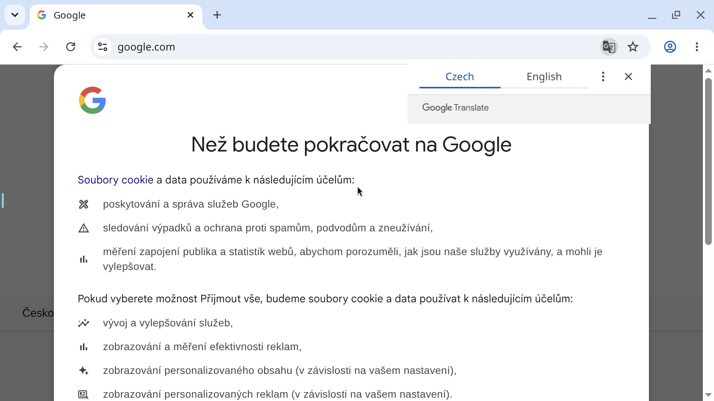

# Chromium Browser

A containerized Chromium browser with MCP (Model Context Protocol) extension support, built on LinuxServer.io's Chrome image and accessed over a Selkies/KasmVNC web session (browser-in-browser).



## Usage

```bash
make docker-up
```

Then open the web UI:

- HTTP: http://localhost:3000 (proxy this)
- HTTPS: https://localhost:3001 (primary; self-signed cert — accept the browser warning)

No password is configured. The desktop needs ~20–40s after the container is up before Chrome finishes painting inside the canvas. The `chrome-mcp` extension port is exposed on `12306`.

> **amd64-only image / Apple Silicon.** `lscr.io/linuxserver/chrome` has no arm64 variant, so on Apple Silicon it runs under QEMU emulation via `platform: linux/amd64`. The `--disable-gpu --disable-software-rasterizer --no-zygote` flags in `CHROME_CLI` are **required** — without them Chrome's GPU/zygote subprocesses hit `GPU process isn't usable. Goodbye.` (SIGTRAP) under emulation and Chrome exits on launch, leaving a black desktop. The flags force in-process software rendering and are harmless on native amd64.
>
> **`chrome-mcp` extension is not shipped.** `extensions/` is gitignored and empty by default, so `--load-extension=/config/extensions/chrome-mcp` loads nothing (Chrome shows a one-time "couldn't load extension" notice but still runs). Populate `extensions/chrome-mcp/` to enable it.

## Services

| Container | Port(s) | Description |
|-----------|---------|-------------|
| **chrome** | `3000` (HTTP), `3001` (HTTPS), `12306` (chrome-mcp) | LinuxServer Chrome with web desktop access and MCP extension loading |

## Configuration

Environment variables in `docker-compose.yml`:

| Variable | Default | Notes |
|----------|---------|-------|
| `PUID` | `1000` | User ID for file permissions |
| `PGID` | `1000` | Group ID for file permissions |
| `TZ` | `Europe/Prague` | Timezone |
| `CHROME_CLI` | `--disable-gpu --disable-software-rasterizer --no-zygote --load-extension=… https://google.com` | Chrome launch arguments (see emulation note above) |

## Volumes

| Path | Contents |
|------|----------|
| `.docker/config/` | Chrome profile / runtime state (delete to reset) |
| `./extensions/` | MCP extensions mounted at `/config/extensions` (gitignored) |

## Observability

| Check | Endpoint / Command |
|-------|--------------------|
| UI | Open https://localhost:3001 in a browser |
| Logs | `docker compose logs -f chrome` |

## Resources

- GitHub: https://github.com/linuxserver/docker-chromium
- Docs: https://docs.linuxserver.io/images/docker-chromium
