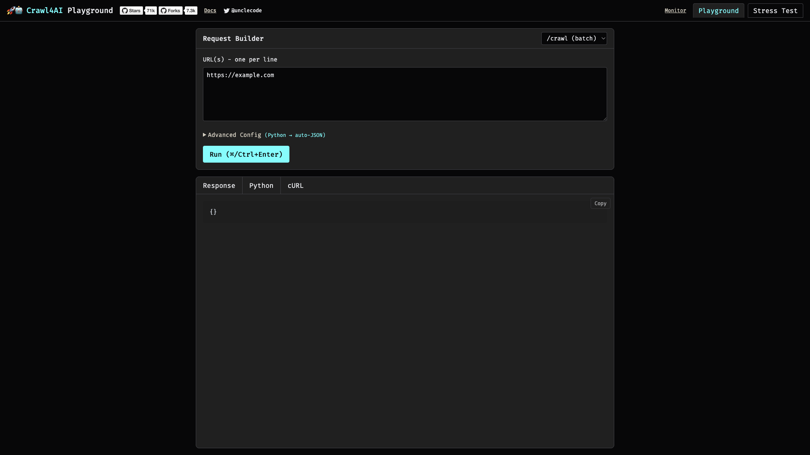

# Crawl4AI

AI-powered web crawler and scraper with built-in headless Chromium. Extracts structured data from websites using LLM-based extraction strategies, exposed over an HTTP API with an interactive playground.



## Usage

```bash
make docker-up
```

Reach it at:

- **API**: http://localhost:11235 (health at `/health`)
- **Playground UI**: http://localhost:11235/playground — build/run requests, inspect the JSON response, copy the equivalent Python/cURL
- **API docs**: http://localhost:11235/docs

The image is large (multi-GB); first `docker compose up -d` pulls it and boot takes a minute or two while the browser pool warms up.

> **Loopback-by-default bind (boot gotcha).** crawl4ai ≥ 0.9.0 binds gunicorn to `127.0.0.1` unless a credential is set, so the published port `11235` is dead otherwise. This stack sets a sandbox-safe `CRAWL4AI_API_TOKEN` (default `crawl4ai-sandbox`) so the API is reachable and authenticated. Every request (including `/playground` and its assets) must carry the token as a bearer header — only `/health` and `/token` are public. The container reports `healthy` from its internal `/health` probe even while the host port is unreachable; check for `Listening at: http://[::]:11235` (not `127.0.0.1`) in the logs to confirm the host-facing bind.

<details>
<summary>API examples</summary>

Basic crawl:

```bash
curl -X POST http://localhost:11235/crawl \
    -H "Authorization: Bearer ${CRAWL4AI_API_TOKEN:-crawl4ai-sandbox}" \
    -H "Content-Type: application/json" \
    -d '{"urls": ["https://example.com"]}'
```
</details>

## Services

| Container | Port(s) | Description |
|-----------|---------|-------------|
| **crawl4ai** | `11235` | Crawl4AI server with headless Chromium (4 GB mem limit, 1 GB shared memory) |

## Configuration

Environment variables (sandbox-safe defaults; set in environment or `.env`):

| Variable | Default | Notes |
|----------|---------|-------|
| `CRAWL4AI_API_TOKEN` | `crawl4ai-sandbox` | Bearer token required by all API endpoints — **change** for anything exposed off-host |
| `OPENAI_API_KEY` | *(unset)* | OpenAI key for LLM-based extraction |
| `ANTHROPIC_API_KEY` | *(unset)* | Anthropic key for LLM-based extraction |

## Volumes

None — stateless (`/dev/shm` is bind-mounted for Chromium shared memory, not persistence).

## Observability

| Check | Endpoint / Command |
|-------|--------------------|
| Health | `curl http://localhost:11235/health` (Compose healthcheck probes the same) |
| Logs | `docker compose logs -f crawl4ai` |

## Resources

- GitHub: https://github.com/unclecode/crawl4ai
- Docs: https://docs.crawl4ai.com
