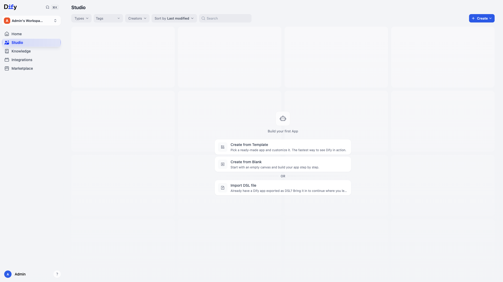

# Dify

Open-source LLM app development platform — a visual workflow/agent builder with
RAG pipelines, prompt orchestration, and a model-agnostic backend. Build
assistants, agents, and chat apps on a drag-and-drop canvas, then expose them as
REST APIs or **MCP servers**. This compose is a sandbox-trimmed but bootable
subset of the official `docker/` deployment (Dify `1.15.0`).



## Usage

```bash
make docker-up
```

Open http://localhost:8080 — on first launch you are redirected to
http://localhost:8080/install to create the initial admin (owner) account
(email, username, 8+ char password). After signing in you land on the **Studio**
apps dashboard; add a model provider under **Settings → Model Provider**, then
build an app from a template or a blank canvas.

> **First boot is slow.** This is a large multi-image stack and `api` runs DB
> migrations before the console answers. Poll
> `curl -s -o /dev/null -w '%{http_code}' http://localhost:8080/install` until it
> returns `200` (allow a few minutes on a cold pull).

> **"Failed to request plugin daemon" toasts are expected.** The optional
> `plugin_daemon` service is intentionally omitted from this lean sandbox, so the
> console shows a transient plugin-daemon warning on first load. Core
> app/workflow/RAG features work without it; only the in-app plugin marketplace
> is unavailable.

<details><summary>MCP servers</summary>

Dify apps and workflows can be **published as MCP (Model Context Protocol)
servers**, letting external MCP clients (IDEs, agents, other LLM tools) call your
Dify apps as tools. Publish an app, then expose it via its MCP endpoint under the
app's API/access settings.

</details>

## Services

| Container | Port(s) | Description |
|-----------|---------|-------------|
| **nginx** | `8080` → `80` | Entry reverse proxy — single door to web + api |
| **web** | — | Next.js console / app UI (`dify-web:1.15.0`) |
| **api** | — | Console + service REST API (Flask/Gunicorn, `dify-api:1.15.0`) |
| **worker** | — | Celery worker — datasets, workflows, mail (`dify-api:1.15.0`) |
| **db** | — | PostgreSQL 15 — app metadata and config |
| **redis** | — | Redis 6 — cache + Celery broker |
| **weaviate** | — | Vector store for RAG embeddings (`weaviate:1.27.0`) |
| **sandbox** | — | Secure code-execution runtime (`dify-sandbox:0.2.15`) |
| **ssrf_proxy** | — | Squid forward proxy guarding sandbox egress |
| **init_permissions** | — | One-shot init that fixes storage ownership (busybox) |

Optional upstream services (`plugin_daemon`, `api_websocket`, `certbot`, MySQL,
and alternative vector stores such as Qdrant / pgvector / Milvus / OpenSearch)
are intentionally omitted for a lean local sandbox.

## Configuration

Environment variables in `.env` (loaded via `env_file:`). All defaults are
**sandbox-safe only — change them before any real use.**

| Variable | Default | Notes |
|----------|---------|-------|
| `SECRET_KEY` | `sk-dify-sandbox-CHANGE-ME…` | Session/data signing key — **change**; generate with `openssl rand -base64 42` |
| `DB_PASSWORD` | `difyai123456` | PostgreSQL password — **change** |
| `REDIS_PASSWORD` | `difyai123456` | Redis password (also in `CELERY_BROKER_URL`) — **change** |
| `VECTOR_STORE` | `weaviate` | Vector backend |
| `WEAVIATE_API_KEY` | `WVF5…pkih` | Weaviate API key — **change** |
| `SANDBOX_API_KEY` | `dify-sandbox` | Code-execution sandbox key — **change** |
| `EXPOSE_NGINX_PORT` | `8080` | Host port for the entry proxy |

## Volumes

| Path | Contents |
|------|----------|
| `.docker/app/storage/` | API/worker uploaded files and app storage |
| `.docker/db/data/` | PostgreSQL data |
| `.docker/redis/data/` | Redis persistence |
| `.docker/weaviate/` | Weaviate vector store |
| `.docker/sandbox/dependencies/` | Sandbox runtime dependencies |

## Observability

| Check | Endpoint / Command |
|-------|--------------------|
| Readiness | `curl -s -o /dev/null -w '%{http_code}' http://localhost:8080/install` |
| API health (in-container) | `curl -f http://localhost:5001/health` |
| Logs | `docker compose logs -f api worker nginx` |

## Resources

- GitHub: https://github.com/langgenius/dify
- Docs: https://docs.dify.ai
