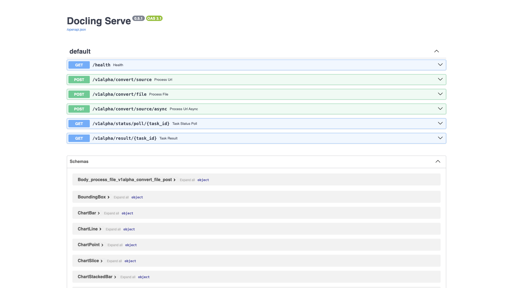

# Document Processing Stack

Bundled document-processing toolkit combining document conversion, OCR, a
headless browser, and image processing into one compose. Useful as a local
one-stop backend for turning documents and pages into text, PDFs, and images.



## Usage

```bash
make docker-up
```

First run builds the local PaddleOCR image (`build: ./paddleocr`), so use
`docker compose up --build` (or `make docker-up`) on the first boot. The
screenshot above is the **Docling Serve Swagger UI** at
http://localhost:5001/docs — the most reliable renderable page in the stack.

> - `paddleocr` builds locally on first run — expect a one-time image build.
> - The `thumbor` image ships as `linux/amd64` only, so it runs under emulation
>   on Apple Silicon (a harmless platform-mismatch warning at boot).
> - Avoid the Docling Gradio `/ui` on `:latest` — it can crash-loop; use `/docs`.
> - All four host ports (5001, 8866, 3000, 8888) must be free. If one clashes
>   with another running stack, add a gitignored `docker-compose.override.yml`
>   to remap it (never commit that override).

<details><summary>API examples</summary>

Convert a document with Docling:

```bash
curl -X POST http://localhost:5001/v1/convert/file \
    -F "file=@document.pdf" -F "output_format=markdown"
```

OCR an image with PaddleOCR:

```bash
curl -X POST http://localhost:8866/ocr -F "file=@scan.png"
```

Screenshot with Browserless:

```bash
curl -X POST http://localhost:3000/screenshot \
    -H "Content-Type: application/json" \
    -d '{"url": "https://example.com"}' -o screenshot.png
```

Resize an image with Thumbor:

```bash
curl "http://localhost:8888/unsafe/300x200/https://example.com/image.jpg" -o resized.jpg
```

</details>

## Services

| Container | Port(s) | Description |
|-----------|---------|-------------|
| **docling** | `5001` | Document conversion — PDF/DOCX → Markdown/JSON (`docling-serve:latest`) |
| **paddleocr** | `8866` | OCR REST API supporting 80+ languages (local `build: ./paddleocr`) |
| **browserless** | `3000` | Headless Chromium for screenshots and PDF generation |
| **thumbor** | `8888` | On-demand image processing / resizing |

## Configuration

Values are set inline in `docker-compose.yml` (no `.env`); sandbox-safe defaults:

| Variable | Default | Notes |
|----------|---------|-------|
| `CONCURRENT` | `3` | Browserless concurrent sessions |
| `TIMEOUT` | `30000` | Browserless session timeout (ms) |
| `THUMBOR_SECURITY_KEY` | `thumbor-sandbox-key` | Thumbor URL signing key — **change** for real use |
| `ALLOW_UNSAFE_URL` | `True` | Allows unsigned Thumbor URLs (sandbox convenience) |

## Volumes

| Path | Contents |
|------|----------|
| `.docker/thumbor/` | Thumbor result / storage cache |

## Observability

| Check | Endpoint / Command |
|-------|--------------------|
| Docling health | `curl http://localhost:5001/health` |
| Logs | `docker compose logs -f docling paddleocr browserless thumbor` |

## Resources

- Docling: https://github.com/docling-project/docling-serve
- PaddleOCR: https://github.com/PaddlePaddle/PaddleOCR
- Browserless: https://github.com/browserless/browserless
- Thumbor: https://github.com/minimalcompact/thumbor
