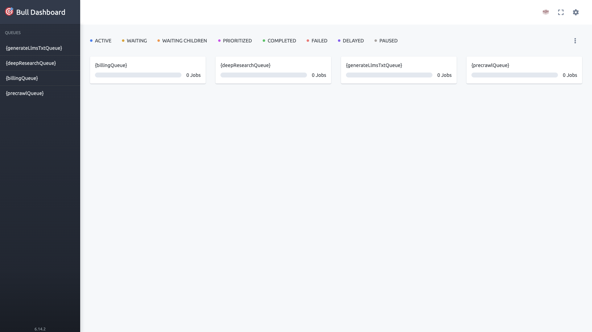

# Firecrawl

Web scraping and crawling API with browser automation, structured data
extraction, and queue-based job processing. API-first — point it at a URL and
get back clean content, or crawl a whole site through the job queue.



## Usage

```bash
make docker-up
```

The API is served on host port `3002` and returns `200` within ~15–20s of boot.
The root path returns a small status JSON:

```bash
curl -s http://localhost:3002
# {"message":"Firecrawl API","documentation_url":"https://docs.firecrawl.dev"}
```

The screenshot above is the **Bull queue dashboard** (the stack's only rich UI),
at http://localhost:3002/admin/firecrawl-sandbox-key/queues — the admin path key
is the `BULL_AUTH_KEY` set in `docker-compose.yml` (`firecrawl-sandbox-key`).

> `rabbitmq` uses a healthcheck and `api` waits for it via
> `depends_on: condition: service_healthy`, so first boot is gated on RabbitMQ
> becoming healthy (~10s). No repo-config changes are needed — plain
> `make docker-up` boots clean.

<details><summary>API examples</summary>

Scrape a single page:

```bash
curl -X POST http://localhost:3002/v1/scrape \
    -H "Content-Type: application/json" \
    -d '{"url": "https://example.com"}'
```

Crawl a website:

```bash
curl -X POST http://localhost:3002/v1/crawl \
    -H "Content-Type: application/json" \
    -d '{"url": "https://example.com", "limit": 10}'
```

</details>

## Services

| Container | Port(s) | Description |
|-----------|---------|-------------|
| **api** | `3002` | Firecrawl API server + worker harness (`firecrawl:latest`) |
| **playwright-service** | — | Headless browser for JavaScript-rendered pages |
| **redis** | — | Rate limiting and caching |
| **rabbitmq** | — | Job queue (management image, healthchecked) |
| **nuq-postgres** | — | PostgreSQL for persistent storage |

## Configuration

Sandbox-safe values are baked into `docker-compose.yml`; optional overrides via
shell or `.env`:

| Variable | Default | Notes |
|----------|---------|-------|
| `BULL_AUTH_KEY` | `firecrawl-sandbox-key` | Queue admin path key — **change** for real use |
| `OPENAI_API_KEY` | (empty) | For AI-powered extraction features |
| `OPENAI_BASE_URL` | (empty) | Custom LLM endpoint (e.g. OpenRouter) |
| `MODEL_NAME` | (empty) | LLM model used for extraction |

## Volumes

| Path | Contents |
|------|----------|
| `.docker/redis/` | Redis persistence |
| `.docker/rabbitmq/` | RabbitMQ data |
| `.docker/postgres/` | PostgreSQL data |

## Observability

| Check | Endpoint / Command |
|-------|--------------------|
| API status | `curl -s http://localhost:3002` |
| Queue dashboard | `http://localhost:3002/admin/firecrawl-sandbox-key/queues` |
| Logs | `docker compose logs -f api` |

## Resources

- GitHub: https://github.com/firecrawl/firecrawl
- Docs: https://docs.firecrawl.dev
