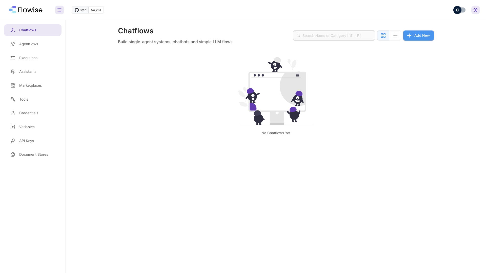

# Flowise

Visual drag-and-drop builder for LLM agents and workflows. Compose chatflows,
agents, and RAG pipelines from a node graph, then expose them via REST API or
embed them. Ships with a large node library (LLMs, vector stores, tools, memory)
and uses SQLite out of the box — no external database required.



## Usage

```bash
make docker-up
```

Open http://localhost:3000. Flowise 3.x presents an **account screen** on first
run — register / sign in as the admin, then you land on the Chatflows /
Agentflows dashboard and build flows from the node canvas. The
`FLOWISE_USERNAME` / `FLOWISE_PASSWORD` (`admin` / `admin`) in `.env` seed those
credentials.

> The entrypoint runs `sleep 3; flowise start`, adding a small startup delay; the
> healthcheck polls `/api/v1/ping` until the app is ready.

<details><summary>MCP support</summary>

Flowise integrates with the Model Context Protocol on both sides:

- **As an MCP client** — the *Custom MCP* / *MCP* tool nodes let a chatflow or
  agent connect to external MCP servers (stdio or SSE) and call their tools.
- **As an MCP-style backend** — each deployed flow is reachable over the REST
  API, so it can be wrapped and consumed by other agents/tools.

For stdio MCP servers, review the `CUSTOM_MCP_*` security env vars in the
[official `.env` example](https://raw.githubusercontent.com/FlowiseAI/Flowise/main/docker/.env.example)
before enabling arbitrary command execution.

</details>

## Services

| Container | Port(s) | Description |
|-----------|---------|-------------|
| **flowise** | `3000` | Flowise app (UI + REST API), SQLite storage (`flowiseai/flowise:3.1.3`) |

## Configuration

Environment variables in `.env` (sandbox-safe defaults):

| Variable | Default | Notes |
|----------|---------|-------|
| `FLOWISE_USERNAME` | `admin` | Basic-auth username — **change** |
| `FLOWISE_PASSWORD` | `admin` | Basic-auth password — **change** |
| `PORT` | `3000` | HTTP port (host and container) |
| `DATABASE_TYPE` | `sqlite` | `sqlite` (default) or `postgres` |
| `DATABASE_PATH` | `/root/.flowise` | SQLite + config location |
| `SECRETKEY_PATH` | `/root/.flowise` | Encryption key store for credentials |
| `BLOB_STORAGE_PATH` | `/root/.flowise/storage` | Uploaded file / blob storage |
| `LOG_PATH` | `/root/.flowise/logs` | Log directory |
| `DISABLE_FLOWISE_TELEMETRY` | `true` | Disable anonymous usage analytics |

## Volumes

| Path | Contents |
|------|----------|
| `.docker/flowise/` | Flows, credentials, API keys, SQLite DB, logs — delete to reset |

## Observability

| Check | Endpoint / Command |
|-------|--------------------|
| Health | `curl http://localhost:3000/api/v1/ping` |
| Logs | `docker compose logs -f flowise` |

## Resources

- GitHub: https://github.com/FlowiseAI/Flowise
- Docs: https://docs.flowiseai.com
