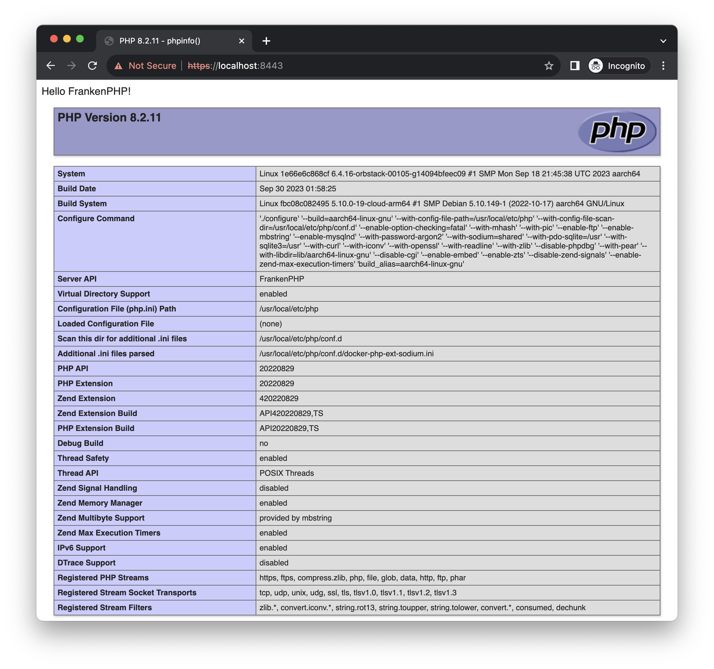

# FrankenPHP demo

## Get started

- `make install` - install dependencies
- `make dev` - run PHP build-in development server
- `make franken` - run FrankenPHP development server
- `make docker-build` - build docker image
- `make docker-up` - start docker stack
- `make docker-in` - enter docker container

## Demo

