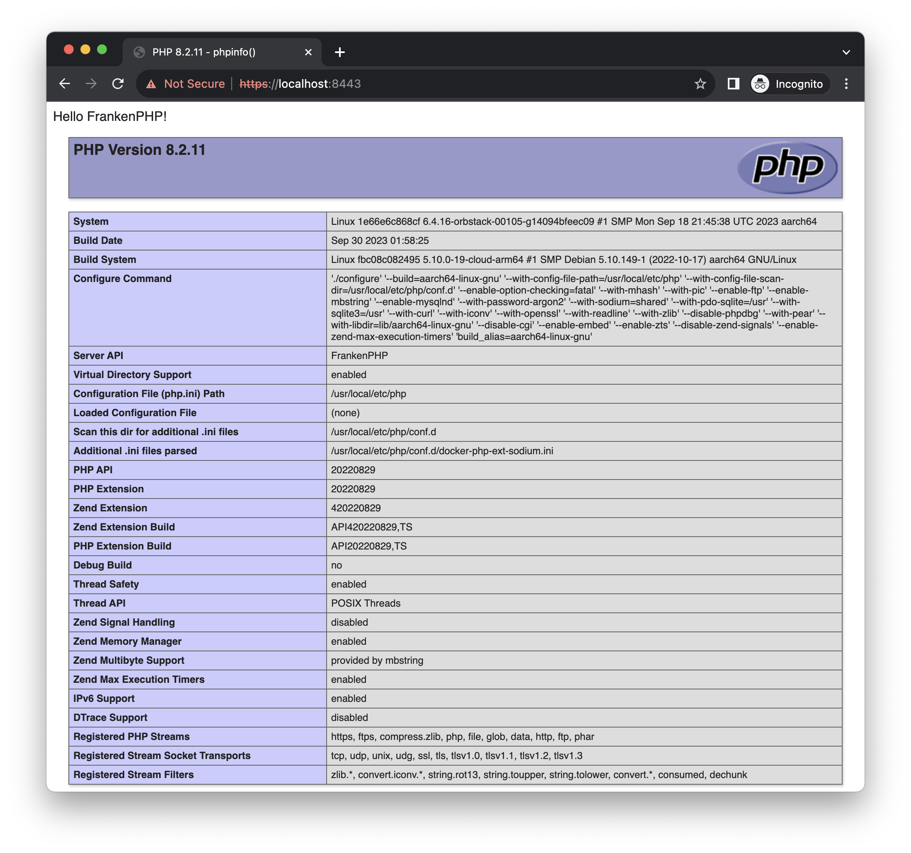

# FrankenPHP demo


## Running

The `app` service builds a local `frankapp` image from the `Dockerfile`
(FrankenPHP + Caddy), so build on first run:

```bash
docker compose up -d --build
```

- Open [`https://localhost:8443`](https://localhost:8443) — Caddy serves
  `public/worker.php` in FrankenPHP worker mode, printing **"Hello
  FrankenPHP!"** followed by full `phpinfo()`.
- Plain HTTP on `http://localhost:8080` is redirected to HTTPS by Caddy.
- No authentication.

### Notes

- Caddy issues a **self-signed certificate** for `localhost`, so the browser
  will warn about an untrusted cert — accept/proceed to view the page. With
  `curl`, use `-k` (e.g. `curl -k https://localhost:8443`).
- Host port mapping is `8080:80` and `8443:443`; the HTTP→HTTPS redirect
  targets the standard `:443`, so opening `https://localhost:8443` directly is
  the reliable path.
- `FRANKENPHP_CONFIG=worker /srv/public/worker.php` runs the app as a
  persistent worker (the source tree is bind-mounted at `/srv`).

## Get started

- `make install` - install dependencies
- `make dev` - run PHP build-in development server
- `make franken` - run FrankenPHP development server
- `make docker-build` - build docker image
- `make docker-up` - start docker stack
- `make docker-in` - enter docker container

## Demo


