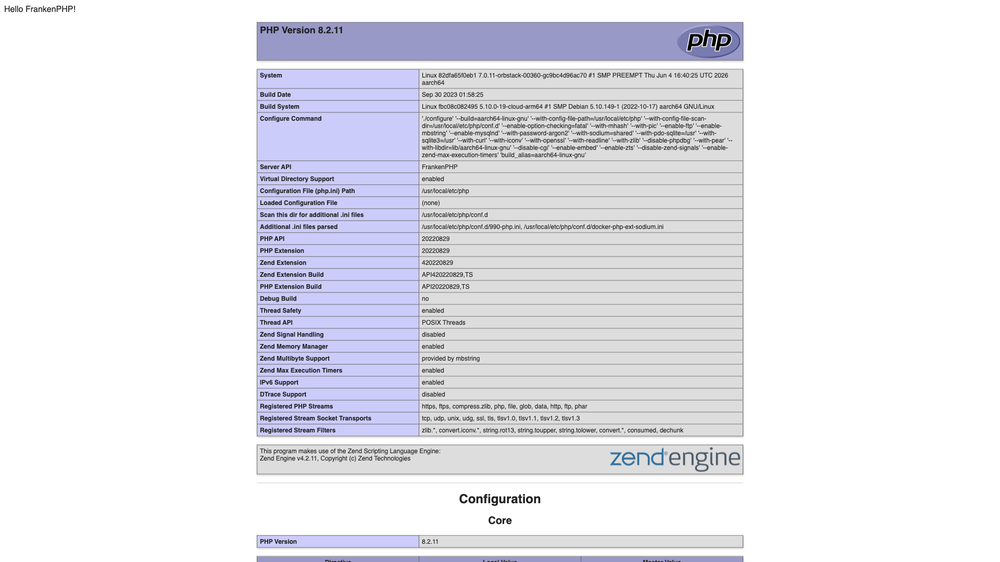

# FrankenPHP demo

A minimal FrankenPHP + Caddy demo app. Caddy serves `public/worker.php` in
FrankenPHP **worker mode**, printing "Hello FrankenPHP!" followed by full
`phpinfo()`. Useful as a reference for running PHP under FrankenPHP's persistent
worker runtime.



## Usage

```bash
make docker-up
```

The `app` service builds a local `frankapp` image from the `Dockerfile`
(FrankenPHP + Caddy), so the first boot needs a build — `make docker-up` runs
`docker compose up`; on a cold checkout use `docker compose up -d --build`.

- Open https://localhost:8443 — the FrankenPHP worker page.
- Plain HTTP on http://localhost:8080 is redirected to HTTPS by Caddy.
- No authentication.

> - Caddy issues a **self-signed certificate** for `localhost`, so the browser
>   warns about an untrusted cert — accept/proceed to view the page. With `curl`,
>   use `-k` (e.g. `curl -k https://localhost:8443`).
> - Host port mapping is `8080:80` and `8443:443`; the HTTP→HTTPS redirect
>   targets the standard `:443`, so opening `https://localhost:8443` directly is
>   the reliable path.
> - `FRANKENPHP_CONFIG=worker /srv/public/worker.php` runs the app as a
>   persistent worker (the source tree is bind-mounted at `/srv`).

## Services

| Container | Port(s) | Description |
|-----------|---------|-------------|
| **app** | `8080` → `80`, `8443` → `443` | Local `frankapp` build (FrankenPHP + Caddy) serving `public/worker.php` |

## Configuration

Set inline in `docker-compose.yml`:

| Variable | Default | Notes |
|----------|---------|-------|
| `FRANKENPHP_CONFIG` | `worker /srv/public/worker.php` | Runs the app in FrankenPHP worker mode |
| `CADDY_DEBUG` | `debug` | Caddy debug logging |
| `DEBUG` | `debug` | App debug flag |

## Volumes

None — stateless. The source tree (`./:/srv`) and `./Caddyfile` are bind-mounted
as application code, not runtime state.

## Observability

| Check | Endpoint / Command |
|-------|--------------------|
| Verify | `curl -k https://localhost:8443` |
| Logs | `docker compose logs -f app` |

## Resources

- GitHub: https://github.com/php/frankenphp
- Docs: https://frankenphp.dev/docs/
