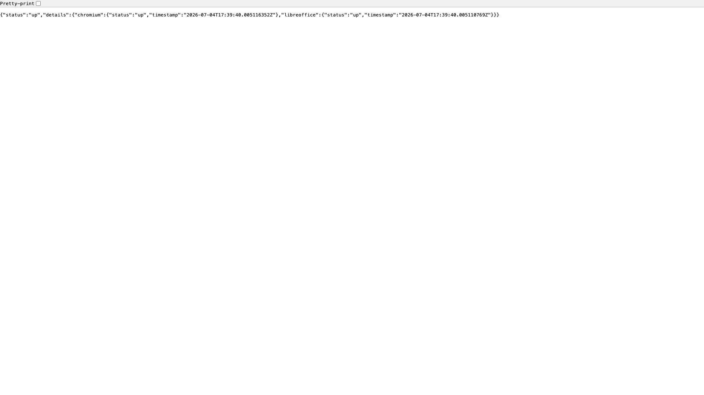

# Gotenberg

HTML, Office, and document → PDF conversion API powered by Chromium and
LibreOffice. API-only — send a document or URL and get back a rendered PDF.



## Usage

```bash
make docker-up
```

The API is served at http://localhost:3000. Gotenberg has no web dashboard, so
`/` and most paths return `404` for browsers; the one browser-renderable
endpoint is the health check (the screenshot above is that `/health` JSON page):

```bash
curl -s http://localhost:3000/health
# {"status":"up","details":{"chromium":{"status":"up",...},"libreoffice":{"status":"up",...}}}
```

> - The compose command hardens Chromium: JavaScript is disabled
>   (`--chromium-disable-javascript=true`) and file access is restricted to `/tmp`
>   (`--chromium-allow-list=file:///tmp/.*`).
> - Default host port is `3000`. If another sandbox stack already binds `3000`,
>   add a gitignored `docker-compose.override.yml` remapping it
>   (`ports: !override`) — do not commit the override.

<details><summary>API examples</summary>

Convert an HTML file to PDF:

```bash
echo '<h1>Hello Gotenberg</h1>' > index.html
curl -X POST http://localhost:3000/forms/chromium/convert/html \
    -F "files=@index.html" -o result.pdf
```

Convert a URL to PDF:

```bash
curl -X POST http://localhost:3000/forms/chromium/convert/url \
    -F "url=https://example.com" -o result.pdf
```

Convert an Office document to PDF:

```bash
curl -X POST http://localhost:3000/forms/libreoffice/convert \
    -F "files=@document.docx" -o result.pdf
```

</details>

## Services

| Container | Port(s) | Description |
|-----------|---------|-------------|
| **gotenberg** | `3000` | Gotenberg API with Chromium and LibreOffice engines (`gotenberg/gotenberg:8`) |

## Configuration

No `.env` — behaviour is set via command flags in `docker-compose.yml`:

| Flag | Value | Notes |
|------|-------|-------|
| `--chromium-disable-javascript` | `true` | Disables JS in Chromium rendering |
| `--chromium-allow-list` | `file:///tmp/.*` | Restricts Chromium file access to `/tmp` |

## Volumes

None — stateless.

## Observability

| Check | Endpoint / Command |
|-------|--------------------|
| Health | `curl http://localhost:3000/health` |
| Logs | `docker compose logs -f gotenberg` |

## Resources

- GitHub: https://github.com/gotenberg/gotenberg
- Docs: https://gotenberg.dev/docs/getting-started/introduction
