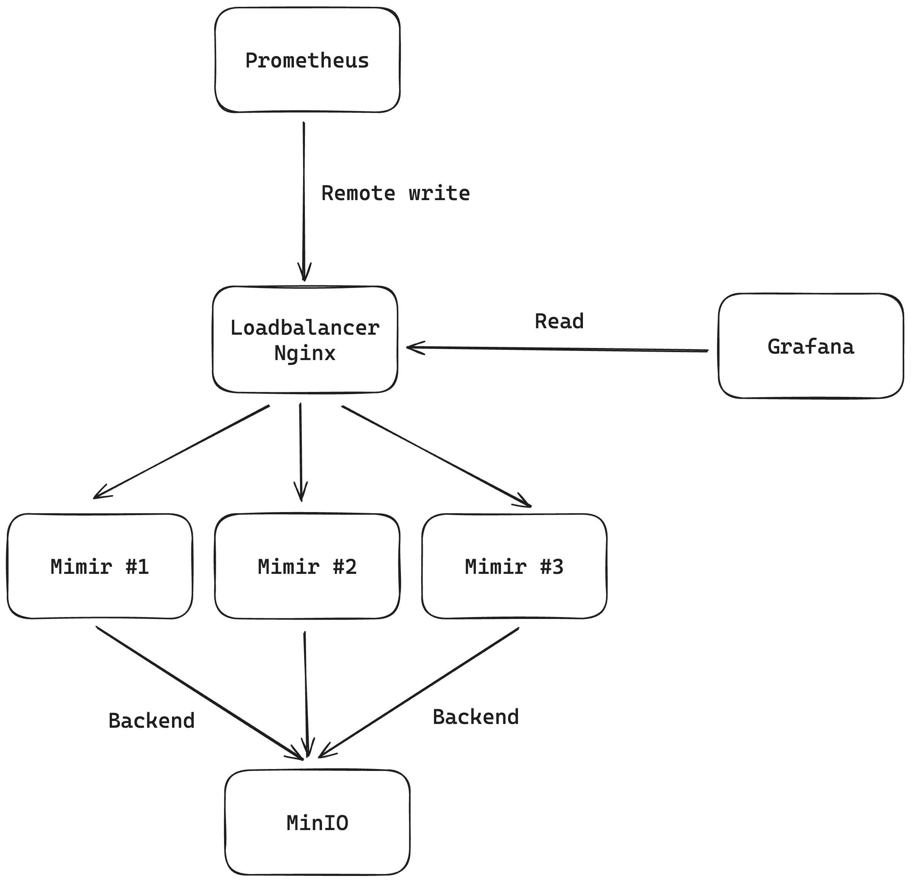
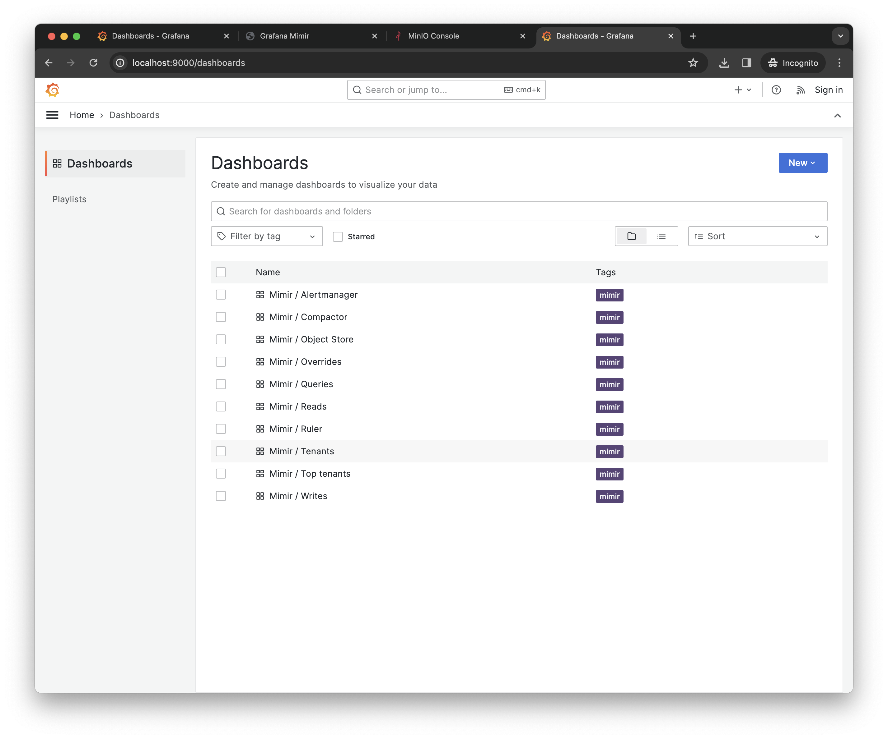
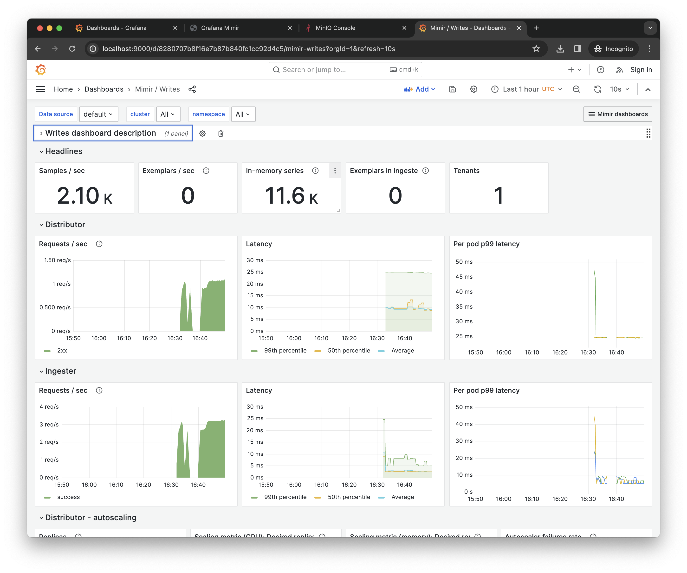
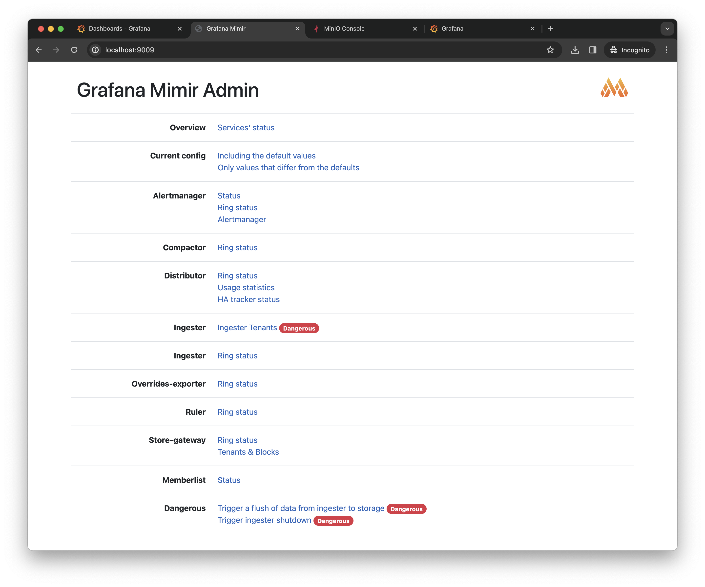
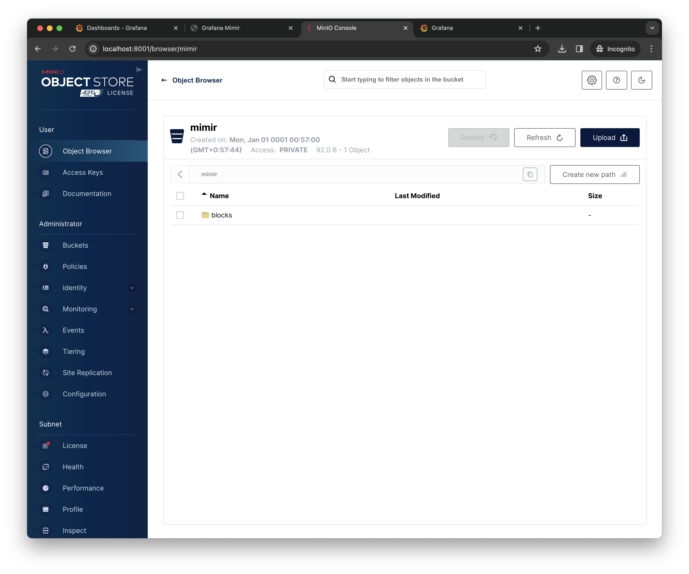
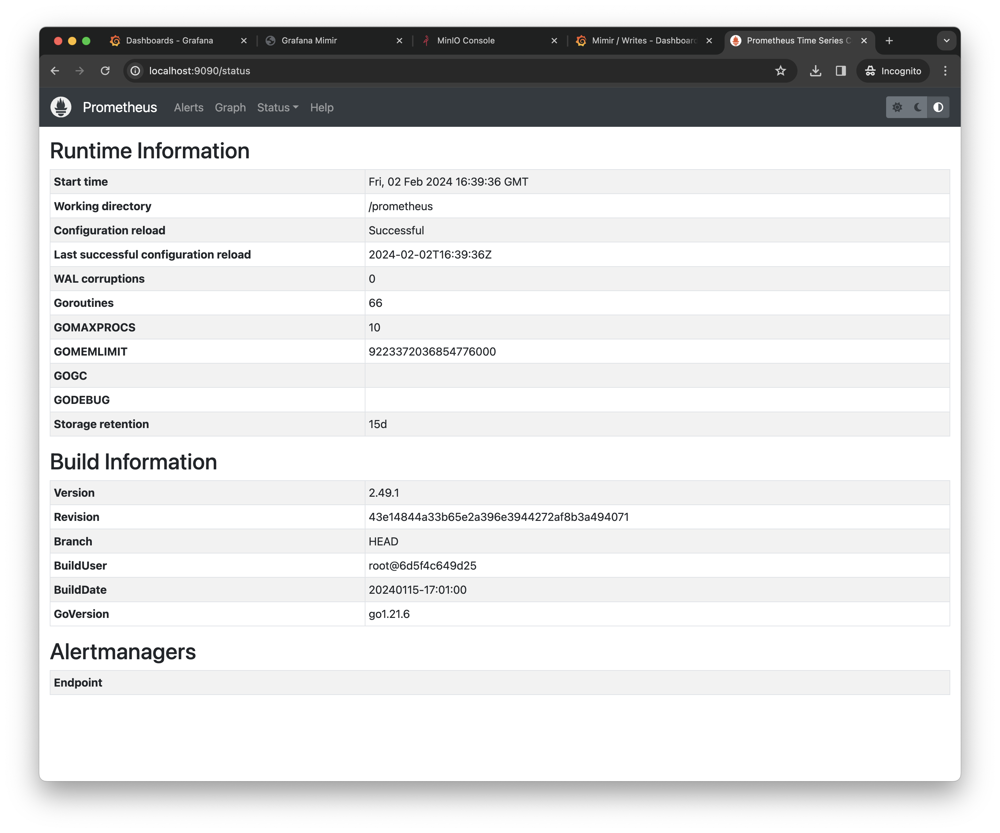
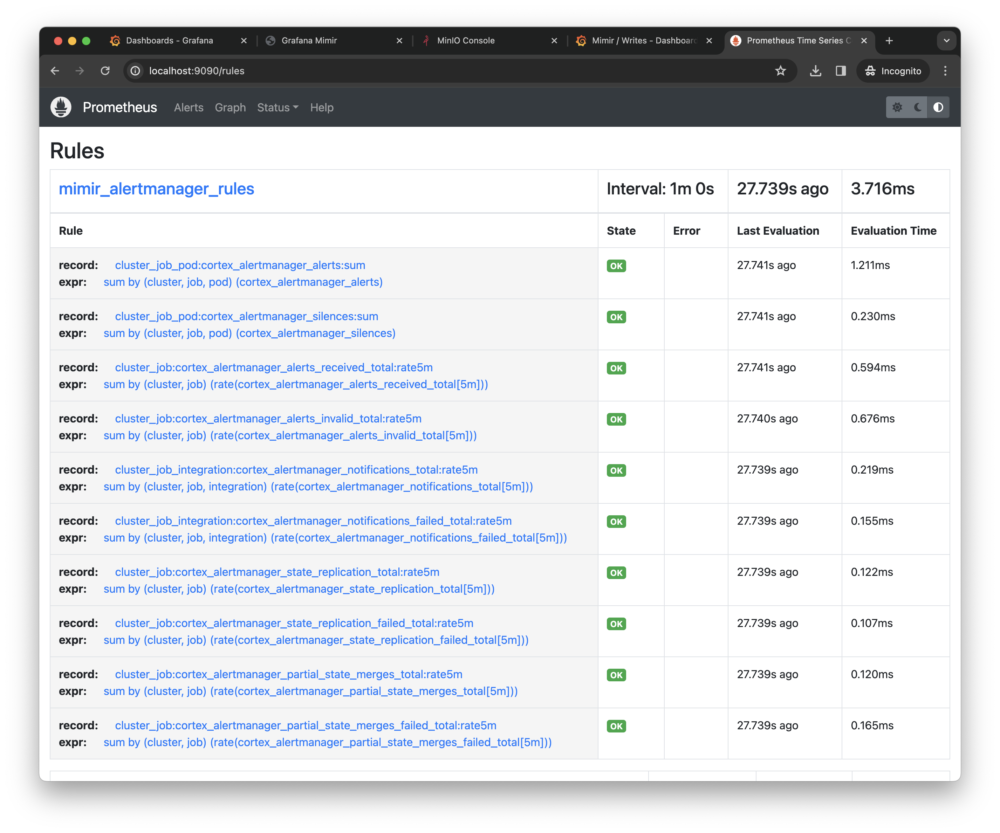

# Grafana stack

- Grafana on [`http://localhost:9000`](http://localhost:9000)
- Grafana Mimir on [`http://localhost:9009`](http://localhost:9009)
- Prometheus on [`http://localhost:9090`](http://localhost:9090)
- MinIO Console on [`http://localhost:8001`](http://localhost:8001)
- MinIO API on [`http://localhost:8000`](http://localhost:800)

## Usage

```
docker compose up
```

## Architecture



## Examples







