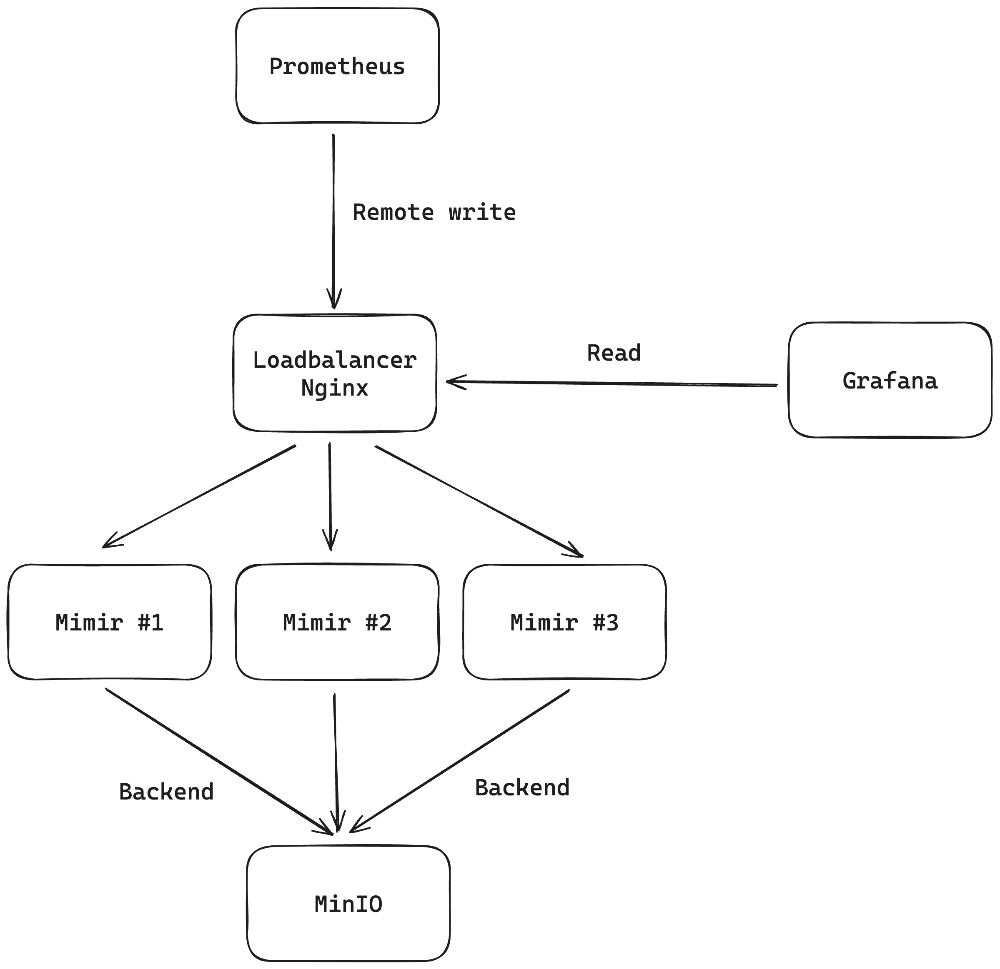
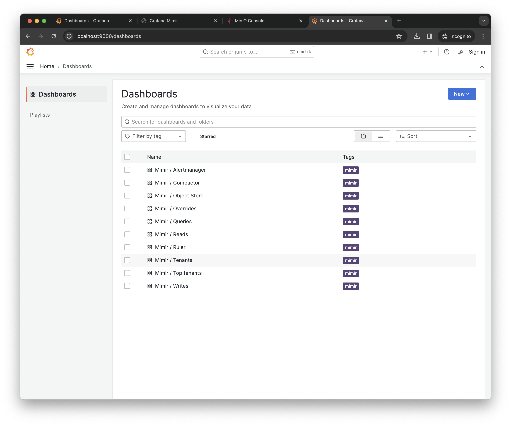
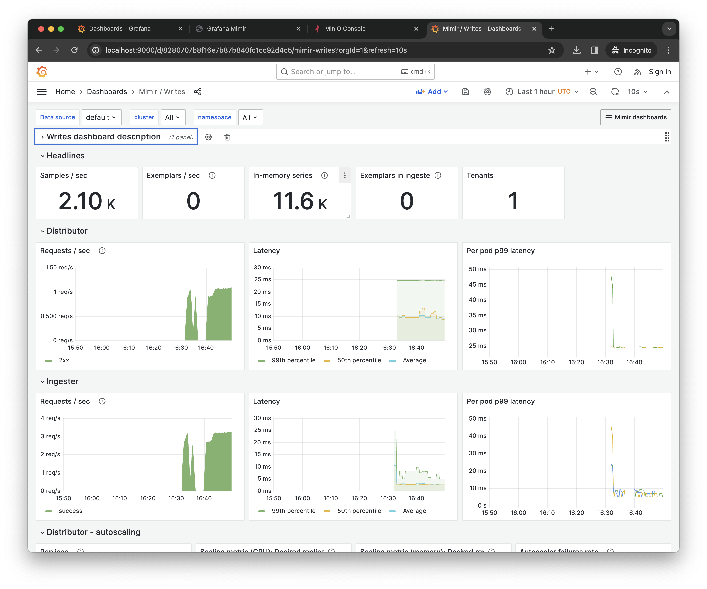
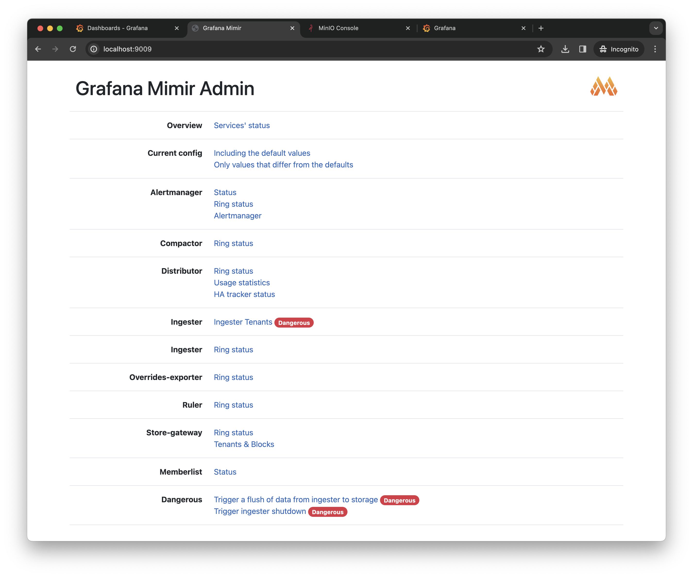
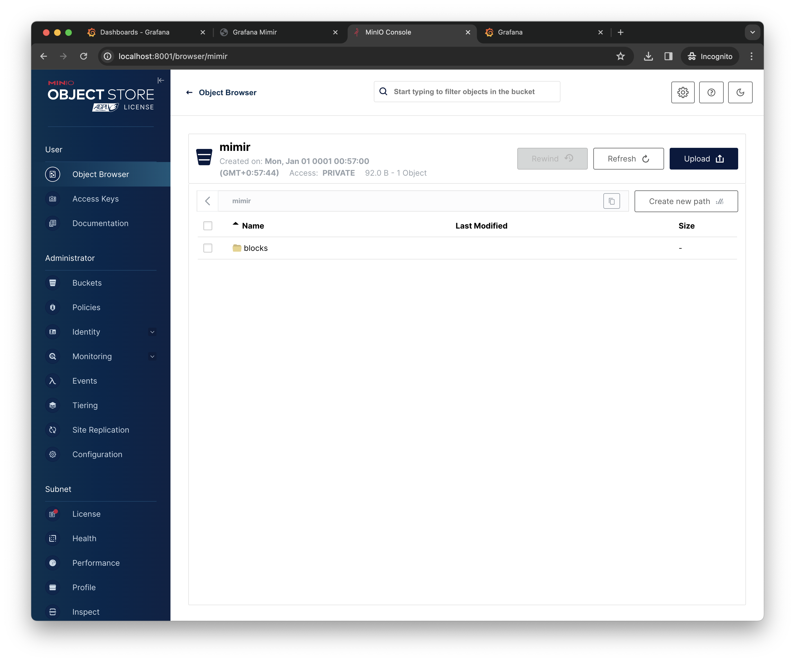
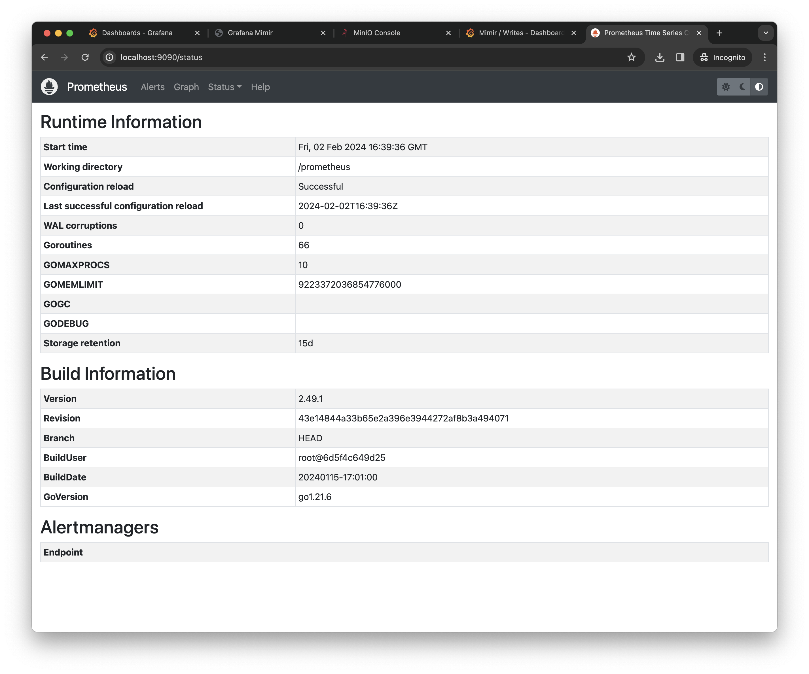
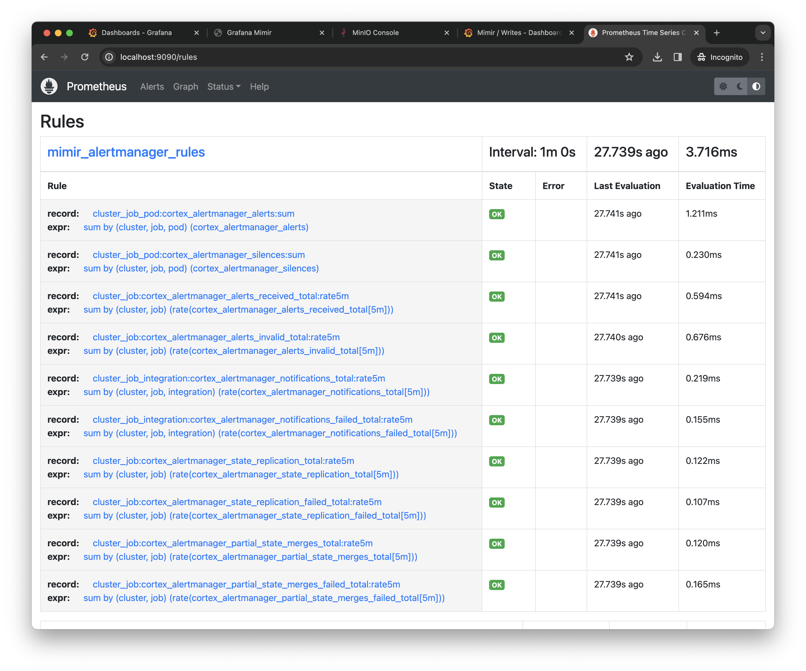

# Grafana stack


- Grafana on [`http://localhost:9000`](http://localhost:9000)
- Grafana Mimir on [`http://localhost:9009`](http://localhost:9009)
- Prometheus on [`http://localhost:9090`](http://localhost:9090)
- MinIO Console on [`http://localhost:8001`](http://localhost:8001)
- MinIO API on [`http://localhost:8000`](http://localhost:800)

## Usage

```
docker compose up
```

## Running

```bash
docker compose up -d
```

- **Grafana**: <http://localhost:9000> — anonymous access is enabled with the
  `Admin` org role (`GF_AUTH_ANONYMOUS_ENABLED=true` in `docker-compose.yml`),
  so no login is required. To sign in as a real user the default is
  `admin` / `admin`.
- **Prometheus**: <http://localhost:9090> — scrapes the three Mimir replicas
  and remote-writes samples to Mimir through the Nginx load balancer.
- **Mimir (Nginx load balancer)**: <http://localhost:9009> — fronts
  `mimir-1/2/3`; readiness at `/ready`, push at `/api/v1/push`, query at
  `/prometheus`.
- **MinIO API**: <http://localhost:8000> — S3 backend for Mimir blocks,
  alertmanager, and ruler (`mimir` / `supersecret`).
- **MinIO Console**: <http://localhost:8001>.

The `Mimir` Prometheus datasource and the `Mimir / *` dashboards are
provisioned automatically (`grafana/datasources.yaml`, `grafana/dashboards/`).
Open **Dashboards → Mimir / Writes** to see the write path populate with live
data once Prometheus starts remote-writing.

### Notes

- Boots cleanly with a plain `docker compose up -d` on OrbStack (macOS). No
  repo-config fixes were needed.
- Mimir's `/ready` returns `503` for ~20 s on first boot while the three
  replicas form their memberlist ring and MinIO comes up; this self-resolves.
  Grafana itself is reachable within a few seconds.
- The `version:` key at the top of `docker-compose.yml` is obsolete under
  Compose v2 and only emits a harmless warning.

## Architecture



## Examples







