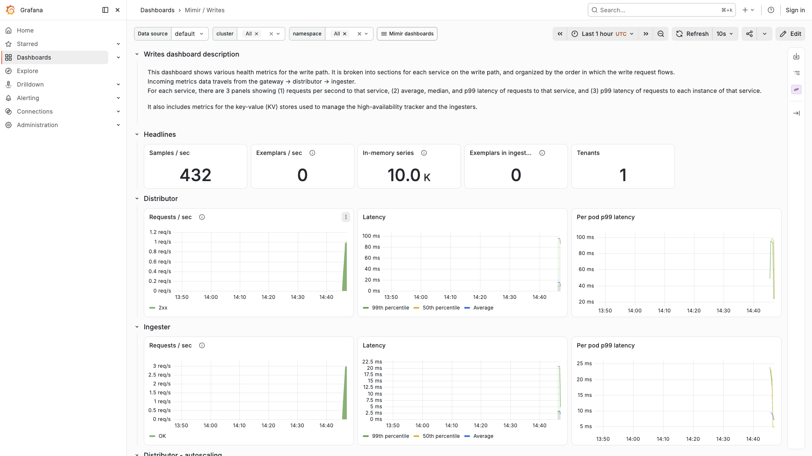

# Grafana stack

Monitoring stack combining Grafana, Prometheus, and a three-replica Grafana
Mimir cluster fronted by an Nginx load balancer, with MinIO as the S3 backend for
Mimir blocks, alertmanager, and ruler. Prometheus scrapes the Mimir replicas and
remote-writes samples back through the load balancer; the Mimir datasource and
dashboards are provisioned automatically.



## Usage

```bash
make docker-up
```

- **Grafana**: http://localhost:9000 — anonymous access is enabled with the
  `Admin` org role (`GF_AUTH_ANONYMOUS_ENABLED=true`), so no login is required;
  to sign in as a real user the default is `admin` / `admin`.
- **Prometheus**: http://localhost:9090 — scrapes the three Mimir replicas and
  remote-writes to Mimir through the Nginx load balancer.
- **Mimir (Nginx load balancer)**: http://localhost:9009 — fronts `mimir-1/2/3`;
  readiness at `/ready`, push at `/api/v1/push`, query at `/prometheus`.
- **MinIO API**: http://localhost:8000 — S3 backend (`mimir` / `supersecret`).
- **MinIO Console**: http://localhost:8001.

Open **Dashboards → Mimir / Writes** in Grafana to watch the write path populate
once Prometheus starts remote-writing.

> - Mimir's `/ready` returns `503` for ~20s on first boot while the three
>   replicas form their memberlist ring and MinIO comes up; this self-resolves.
>   Grafana itself is reachable within a few seconds.
> - The `version:` key at the top of `docker-compose.yml` is obsolete under
>   Compose v2 and only emits a harmless warning.

## Services

| Container | Port(s) | Description |
|-----------|---------|-------------|
| **grafana** | `9000` → `3000` | Grafana UI with provisioned Mimir datasource + dashboards |
| **prometheus** | `9090` | Prometheus — scrapes Mimir and remote-writes to it |
| **load-balancer** | `9009` | Nginx load balancer fronting the Mimir replicas |
| **minio** | `8000` → `9000` (API), `8001` → `9001` (console) | S3 backend for Mimir blocks/alertmanager/ruler |
| **mimir-1** | — | Grafana Mimir replica |
| **mimir-2** | — | Grafana Mimir replica |
| **mimir-3** | — | Grafana Mimir replica |

## Configuration

Set inline in `docker-compose.yml` (sandbox-safe defaults):

| Variable | Default | Notes |
|----------|---------|-------|
| `GF_AUTH_ANONYMOUS_ENABLED` | `true` | Anonymous Grafana access (sandbox convenience) |
| `GF_AUTH_ANONYMOUS_ORG_ROLE` | `Admin` | Role granted to anonymous users |
| `MINIO_ROOT_USER` | `mimir` | MinIO access key — **change** for real use |
| `MINIO_ROOT_PASSWORD` | `supersecret` | MinIO secret key — **change** for real use |

## Volumes

| Path | Contents |
|------|----------|
| `.docker/minio/` | MinIO object storage (Mimir blocks) |
| `.docker/mimir-1/` | Mimir replica 1 data |
| `.docker/mimir-2/` | Mimir replica 2 data |
| `.docker/mimir-3/` | Mimir replica 3 data |

## Observability

| Check | Endpoint / Command |
|-------|--------------------|
| Grafana | `http://localhost:9000` |
| Mimir readiness | `curl http://localhost:9009/ready` |
| Prometheus | `http://localhost:9090` |
| Logs | `docker compose logs -f grafana prometheus load-balancer` |

## Resources

- Grafana: https://github.com/grafana/grafana
- Mimir: https://github.com/grafana/mimir
- Prometheus: https://github.com/prometheus/prometheus
- MinIO: https://github.com/minio/minio
