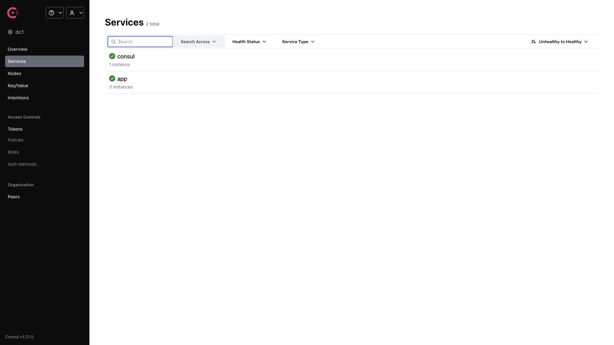

# HAProxy with Consul Service Discovery

HAProxy load-balancing in front of a scaled Bun.js app, with Consul providing
DNS-based service discovery and Registrator auto-registering container instances
from Docker events. HAProxy's `server-template` backend resolves the
`_app._tcp.service.consul` SRV records through Consul's DNS and updates its
backend servers dynamically as replicas come and go.



## Usage

```bash
make docker-up
```

- **App (via HAProxy):** http://localhost:8080 — round-robins across the three
  `app` replicas.
- **HAProxy stats:** http://localhost:8404/stats — note this is on port **8404**,
  not 8080.
- **Consul UI:** http://localhost:8500/ui — the services list shows `consul`
  plus `app` (3 instances registered by Registrator via the Docker socket).

Consul runs in `-dev` mode, so its state is ephemeral and not persisted between
runs. Registrator uses `-internal`, registering each container's internal
`:3000` port; HAProxy discovers instances through Consul DNS on port 8600.

> **Security:** Registrator mounts `/var/run/docker.sock` to watch container
> events. A mounted Docker socket is host-root-equivalent — keep this to local
> use only.

## Services

| Container | Port(s) | Description |
|-----------|---------|-------------|
| **haproxy** | `8080` (→80), `8404` | Load balancer with DNS-based `server-template` backend + stats page |
| **consul** | `8500`, `8600/udp` | Service discovery + DNS interface (dev mode, UI enabled) |
| **app** | — | Bun.js sample server on internal `:3000`, scaled to 3 replicas |
| **registrator** | — | Registers/deregisters app containers with Consul from Docker events |

## Configuration

Configuration lives in files, not env vars (sandbox-safe defaults):

| File / Setting | Default | Notes |
|----------------|---------|-------|
| `haproxy/haproxy.cfg` | — | HAProxy config; `server-template` + DNS resolvers pointed at Consul |
| `app/server.js` | — | Bun.js sample application source |
| `SERVICE_NAME` (app) | `app` | Service name Registrator publishes to Consul |
| `SERVICE_3000_CHECK_HTTP` (app) | `/` | HTTP health-check path registered with Consul |

## Volumes

| Path | Contents |
|------|----------|
| `.docker/consul/data/` | Consul agent data (ephemeral — `-dev` mode does not persist state) |

## Observability

| Check | Endpoint / Command |
|-------|--------------------|
| HAProxy stats | `http://localhost:8404/stats` |
| Consul UI | `http://localhost:8500/ui` |
| Consul DNS | `dig @localhost -p 8600 app.service.consul SRV` |
| Logs | `docker compose logs -f haproxy` |

## Resources

- HAProxy: https://github.com/haproxy/haproxy — https://www.haproxy.org/
- Consul: https://github.com/hashicorp/consul — https://developer.hashicorp.com/consul
- Registrator: https://github.com/gliderlabs/registrator
