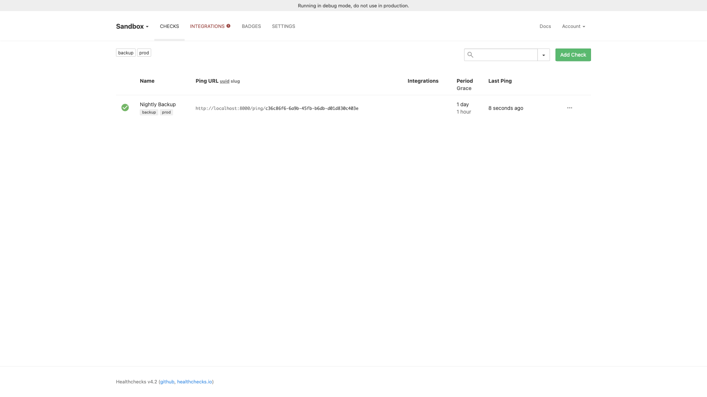

# Healthchecks

Cron job and uptime monitoring. Create checks, receive pings from your scheduled
jobs, and get alerted when something stops reporting on time. Backed by
PostgreSQL 16.



## Usage

```bash
make docker-up
```

Open http://localhost:8000 and sign in at `/accounts/login/`. A superuser is
**created automatically on first startup** from the `SUPERUSER_EMAIL` /
`SUPERUSER_PASSWORD` env vars:

- Email: `admin@localhost`
- Password: `admin`

After login, create a check to get a ping URL, then `curl` it from your job. To
create an admin manually instead, run
`docker compose exec healthchecks python manage.py createsuperuser`.

<details><summary>API examples</summary>

Signal success (job ran OK):

```bash
curl http://localhost:8000/ping/<uuid>
```

Signal failure:

```bash
curl http://localhost:8000/ping/<uuid>/fail
```

</details>

## Services

| Container | Port(s) | Description |
|-----------|---------|-------------|
| **healthchecks** | `8000` | Healthchecks.io web application + ping/API endpoints |
| **db** | — | PostgreSQL 16 database |

## Configuration

Environment variables in `docker-compose.yml` (sandbox-safe defaults):

| Variable | Default | Notes |
|----------|---------|-------|
| `SUPERUSER_EMAIL` | `admin@localhost` | Admin account, created on first boot |
| `SUPERUSER_PASSWORD` | `admin` | Admin password — **change** for real use |
| `SECRET_KEY` | (hardcoded) | Django secret key — **change** for real use |
| `SITE_ROOT` | `http://localhost:8000` | Public URL used in notification links |
| `SITE_NAME` | `Healthchecks` | Instance name shown in the UI |
| `ALLOWED_HOSTS` | `*` | Django allowed hosts |
| `DB_PASSWORD` | `hc-sandbox-password` | PostgreSQL password — **change** for real use |

## Volumes

| Path | Contents |
|------|----------|
| `.docker/db/` | PostgreSQL 16 data |

## Observability

| Check | Endpoint / Command |
|-------|--------------------|
| Web UI | `http://localhost:8000` |
| DB health | `docker compose exec db pg_isready -U hc` |
| Logs | `docker compose logs -f healthchecks` |

## Resources

- GitHub: https://github.com/healthchecks/healthchecks
- Docs: https://healthchecks.io/docs/
