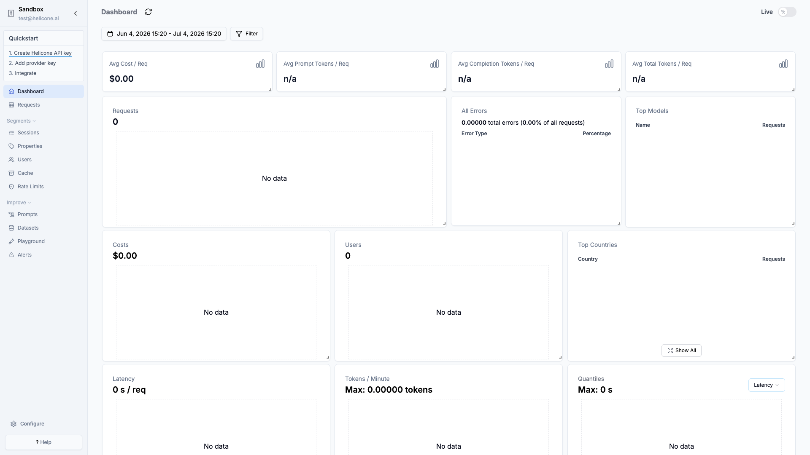

# Helicone

Open-source LLM proxy + analytics platform. Route OpenAI and Anthropic calls
through Helicone to get request logging, cost tracking, user analytics, rate
limiting, and caching.



> Uses the `helicone/helicone-all-in-one` image, which bundles PostgreSQL,
> ClickHouse, MinIO, and Redis into a **single** container. First boot is slow —
> the healthcheck allows a 60s start period before the dashboard responds.
> Self-hosted mode supports **OpenAI and Anthropic only**.

## Usage

```bash
make docker-up
```

Open http://localhost:3000 and sign in with the seeded account
**`test@helicone.ai` / `password`** (the all-in-one image skips email
confirmation), or register a new account and run through the org/onboarding
steps to reach the analytics dashboard.

<details><summary>API examples</summary>

Route calls through the Jawn proxy on port `8585` instead of the provider's
base URL:

**Python (OpenAI):**
```python
from openai import OpenAI

client = OpenAI(
    base_url="http://localhost:8585/v1/gateway/oai/v1",
    api_key="your-openai-api-key",
)
```

**Python (Anthropic):**
```python
import anthropic

client = anthropic.Anthropic(
    base_url="http://localhost:8585/v1/gateway/anthropic",
    api_key="your-anthropic-api-key",
)
```

</details>

## Services

| Container | Port(s) | Description |
|-----------|---------|-------------|
| **helicone** | `3000`, `8585`, `9081` | All-in-one: web UI (`3000`) + Jawn LLM proxy (`8585`) + MinIO S3 API (`9081`→9080) + bundled PostgreSQL / ClickHouse / Redis |

## Configuration

Environment variables in `.env` (sandbox-safe defaults):

| Variable | Default | Notes |
|----------|---------|-------|
| `BETTER_AUTH_SECRET` | `changeme-...` | Session signing secret — **change** (`openssl rand -hex 32`) |
| `SITE_URL` | `http://localhost:3000` | Public URL of the instance |
| `NEXT_PUBLIC_HELICONE_JAWN_SERVICE` | `http://localhost:8585` | Jawn proxy URL |
| `S3_ENDPOINT` | `http://localhost:9081` | MinIO S3 endpoint |
| `S3_ACCESS_KEY` / `S3_SECRET_KEY` | `minioadmin` | MinIO credentials — **change** for real use |
| `NEXT_PUBLIC_IS_ON_PREM` | `true` | Enables on-premise mode |

## Volumes

| Path | Contents |
|------|----------|
| `.docker/postgres/` | PostgreSQL data |
| `.docker/clickhouse/` | ClickHouse analytics data |
| `.docker/minio/` | MinIO object storage (request/response bodies) |

## Observability

| Check | Endpoint / Command |
|-------|--------------------|
| Health | `curl -f http://localhost:3000` (compose healthcheck) |
| Dashboard | `http://localhost:3000` |
| Logs | `docker compose logs -f helicone` |

## Resources

- GitHub: https://github.com/Helicone/helicone
- Docs: https://docs.helicone.ai/
