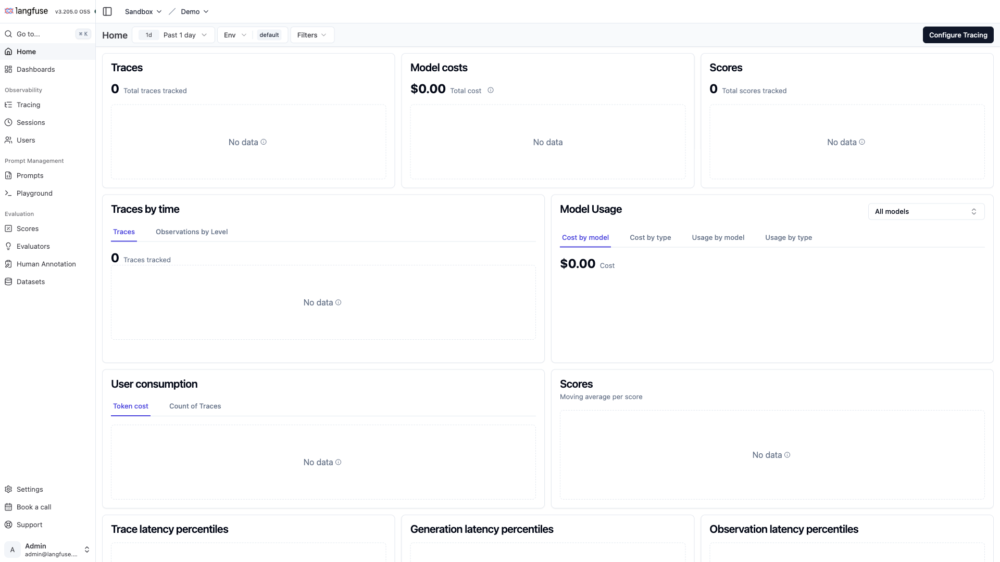

# Langfuse

Open-source LLM engineering platform — tracing, evals, prompt versioning,
datasets, cost tracking, and a playground. Self-hostable LangSmith alternative
(MIT licensed). Pairs naturally with the ysandbox `litellm-proxy` stack.



## Usage

```bash
make docker-up
```

Open http://localhost:3000. On first run, **sign up** to create the initial
user, then create an **Organization** and a **Project** — the project dashboard
is where traces, API keys, and evals live. Grab the project's public/secret keys
(Settings → API Keys) for the SDK snippets below.

> Multi-container stack (web + worker + Postgres + ClickHouse + Redis + MinIO)
> gated by `depends_on` healthchecks — **first boot takes a while** until every
> dependency reports healthy.

> **Security:** Before any non-local use, generate real secrets:
> ```bash
> openssl rand -hex 32   # NEXTAUTH_SECRET
> openssl rand -hex 16   # SALT
> openssl rand -hex 32   # ENCRYPTION_KEY (needs 64 hex chars)
> ```

<details><summary>API examples</summary>

**Python SDK:**
```python
pip install langfuse
from langfuse import Langfuse

langfuse = Langfuse(
    public_key="pk-lf-...",   # Settings → API Keys in UI
    secret_key="sk-lf-...",
    host="http://localhost:3000",
)
```

**LangChain callback:**
```python
from langfuse.callback import CallbackHandler

handler = CallbackHandler(
    public_key="pk-lf-...",
    secret_key="sk-lf-...",
    host="http://localhost:3000",
)
chain.invoke({"input": "..."}, config={"callbacks": [handler]})
```

**LiteLLM integration** (auto-traces calls via the ysandbox litellm-proxy):
```yaml
# litellm/config.yml
litellm_settings:
  success_callback: ["langfuse"]
  failure_callback: ["langfuse"]

environment_variables:
  LANGFUSE_PUBLIC_KEY: "pk-lf-..."
  LANGFUSE_SECRET_KEY: "sk-lf-..."
  LANGFUSE_HOST: "http://langfuse-web:3000"
```

</details>

## Services

| Container | Port(s) | Description |
|-----------|---------|-------------|
| **langfuse-web** | `3000` | Next.js web UI and REST API server |
| **langfuse-worker** | `3030` (localhost) | Background worker for async trace processing |
| **postgres** | `5432` (localhost) | PostgreSQL 17 for project metadata and config |
| **clickhouse** | `8123`, `9000` (localhost) | ClickHouse for trace/span analytics |
| **redis** | `6379` (localhost) | Redis queue for worker job dispatch |
| **minio** | `9090` (→9000), `9091` (console, localhost) | S3-compatible object storage for events + media |

## Configuration

Environment variables in `.env` (sandbox-safe defaults):

| Variable | Default | Notes |
|----------|---------|-------|
| `NEXTAUTH_SECRET` | `mysecret` | Session signing key — **change** |
| `SALT` | `mysalt` | Data hashing salt — **change** |
| `ENCRYPTION_KEY` | `000...` | 64-hex AES-256 key — **change** |
| `POSTGRES_PASSWORD` | `postgres` | Database password — **change** for real use |
| `CLICKHOUSE_PASSWORD` | `clickhouse` | ClickHouse password — **change** for real use |
| `REDIS_AUTH` | `myredissecret` | Redis auth password — **change** for real use |
| `MINIO_ROOT_PASSWORD` | `miniosecret` | MinIO admin password — **change** for real use |
| `TELEMETRY_ENABLED` | `false` | Usage analytics opt-in |

## Volumes

| Path | Contents |
|------|----------|
| `.docker/postgres/` | PostgreSQL 17 data — project metadata and config |
| `.docker/clickhouse/data/` | ClickHouse trace/span analytics data |
| `.docker/clickhouse/logs/` | ClickHouse server logs |
| `.docker/redis/` | Redis queue persistence |
| `.docker/minio/` | MinIO object storage — events and media |

## Observability

| Check | Endpoint / Command |
|-------|--------------------|
| Web UI | `http://localhost:3000` |
| ClickHouse ping | `curl http://localhost:8123/ping` (compose healthcheck) |
| Postgres health | `docker compose exec postgres pg_isready -U postgres` |
| Logs | `docker compose logs -f langfuse-web langfuse-worker` |

## Resources

- GitHub: https://github.com/langfuse/langfuse
- Docs: https://langfuse.com/docs
