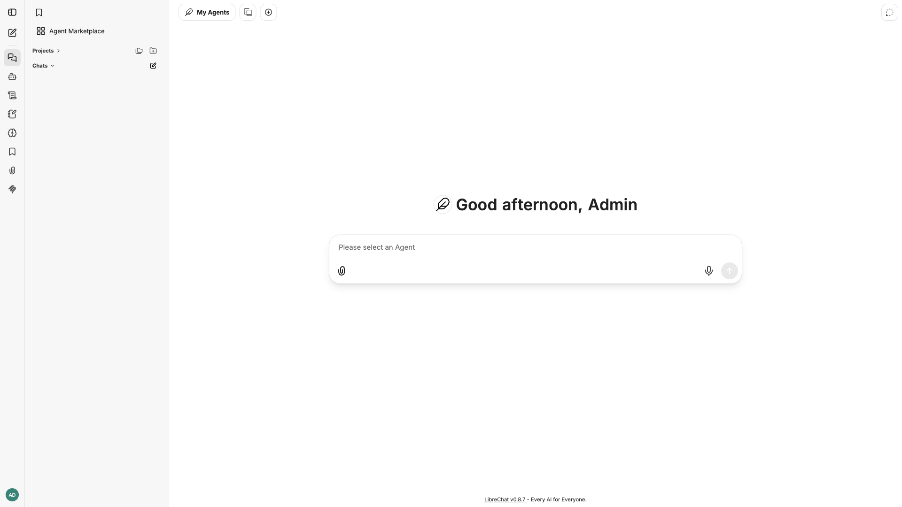

# LibreChat

Multi-model AI chat platform with conversation history, full-text search, and
plugin support. Fronts OpenAI, Anthropic, Google, Azure, and custom endpoints
behind a single web UI, backed by MongoDB for storage and Meilisearch for
search.



## Usage

```bash
make docker-up
```

Open **http://localhost:3080**. On first run, registration is enabled — click
**Sign up** and create the first account (e.g. an `admin` user); this becomes
your login for subsequent visits. The `api` container waits for MongoDB and
Meilisearch to report healthy before starting.

> **MongoDB pinned to `8.0.4`.** Newer `mongo:8.0` patches trip
> [SERVER-121912](https://jira.mongodb.org/browse/SERVER-121912): they require
> the AVX instruction set and refuse to boot on Linux kernels `>= 6.19`,
> crash-looping as `unhealthy`. Reproduced on OrbStack kernel `7.0.11` with the
> unpinned tag; `mongo:8.0.4` predates the kernel check and boots healthy.

## Services

| Container | Port(s) | Description |
|-----------|---------|-------------|
| **api** | `3080` | LibreChat web application |
| **mongodb** | — | MongoDB `8.0.4` — conversation / user storage |
| **meilisearch** | — | Meilisearch `v1.12` — full-text conversation search |

## Configuration

LLM provider keys and app settings live in `.env` (loaded via `env_file:`);
Meilisearch settings are set inline in `docker-compose.yml`:

| Variable | Default | Notes |
|----------|---------|-------|
| `OPENAI_API_KEY` | — | OpenAI key (`.env`); **change** for real use |
| `ANTHROPIC_API_KEY` | — | Anthropic key (`.env`) |
| `GOOGLE_KEY` | — | Google AI key (`.env`) |
| `ALLOW_REGISTRATION` | `true` | Allow new user signups (`.env`) |
| `MEILI_MASTER_KEY` | `meili-sandbox-master-key` | Meilisearch key; **change** for real use |
| `MEILI_NO_ANALYTICS` | `true` | Disable Meilisearch analytics |

Model endpoints can be customized in `librechat.yaml` (mounted read-only into
the `api` container).

## Volumes

| Path | Contents |
|------|----------|
| `.docker/images/` | Uploaded / generated images served by the UI |
| `.docker/logs/` | API logs |
| `.docker/mongodb/` | MongoDB data |
| `.docker/meilisearch/` | Meilisearch index data |

## Observability

| Check | Endpoint / Command |
|-------|--------------------|
| Web UI | `curl -I http://localhost:3080` |
| MongoDB | `docker compose exec mongodb mongosh --eval "db.adminCommand('ping')"` |
| Meilisearch | `docker compose exec meilisearch curl -f http://localhost:7700/health` |
| Logs | `docker compose logs -f api` |

## Resources

- GitHub: https://github.com/danny-avila/LibreChat
- Docs: https://www.librechat.ai/docs
