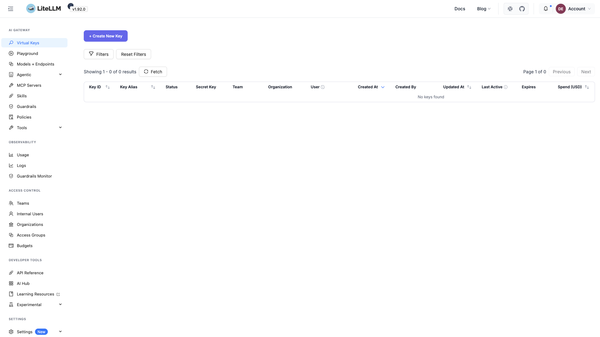

# LiteLLM Proxy

A unified API proxy for many LLM providers, exposing an OpenAI-compatible
endpoint plus an admin UI. State (virtual keys, models added at runtime, usage)
persists to PostgreSQL, and metrics are scraped by a bundled Prometheus. The
sample config proxies Ollama's `llama3.3:70b`.



## Usage

```bash
make docker-up
```

- **Proxy API:** http://localhost:4000 — authenticate with the master key `sk-1234`
- **Admin UI:** http://localhost:4000/ui — log in as user `admin` with password
  `sk-1234` (the `LITELLM_MASTER_KEY`; no separate `UI_PASSWORD` is set)
- **Prometheus:** http://localhost:9090

<details>
<summary>API examples</summary>

```bash
# Liveness
curl http://localhost:4000/health/liveliness

# Chat completion (OpenAI-compatible)
curl http://localhost:4000/v1/chat/completions \
    -H "Authorization: Bearer sk-1234" \
    -H "Content-Type: application/json" \
    -d '{"model": "llama3.3:70b", "messages": [{"role": "user", "content": "hi"}]}'
```

</details>

> `STORE_MODEL_IN_DB=True` — models added in the UI persist to Postgres
> (`.docker/postgres/`). Proxied models come from `litellm/config.yml`, which
> serves Ollama's `llama3.3:70b` from `http://0.0.0.0:11434` by default.

## Services

| Container | Port(s) | Description |
|-----------|---------|-------------|
| **litellm** | `4000` | LiteLLM proxy server + admin UI |
| **db** | `5432` | PostgreSQL `16` — models, keys, usage data |
| **prometheus** | `9090` | Prometheus metrics collection |

## Configuration

Environment variables are set inline in `docker-compose.yml` (sandbox-safe
defaults):

| Variable | Default | Notes |
|----------|---------|-------|
| `LITELLM_MASTER_KEY` | `sk-1234` | Master API key + UI password; **change** for real use |
| `LITELLM_SALT_KEY` | `sk-1234` | Encryption salt key; **change** for real use |
| `DATABASE_URL` | `postgresql://llmproxy:dbpassword9090@db:5432/litellm` | Postgres connection string |
| `STORE_MODEL_IN_DB` | `True` | Persist models added via the UI to Postgres |
| `POSTGRES_USER` / `POSTGRES_PASSWORD` / `POSTGRES_DB` | `llmproxy` / `dbpassword9090` / `litellm` | Database creds; **change** for real use |

Proxied models are declared in `litellm/config.yml`; Prometheus scrape config is
in `prometheus/prometheus.yml`.

## Volumes

| Path | Contents |
|------|----------|
| `.docker/postgres/` | PostgreSQL data (models, keys, usage) |
| `.docker/prometheus/` | Prometheus TSDB (15d retention) |

## Observability

| Check | Endpoint / Command |
|-------|--------------------|
| Health | `curl http://localhost:4000/health/liveliness` |
| Metrics | `http://localhost:9090` (Prometheus UI) |
| Logs | `docker compose logs -f litellm` |

## Resources

- GitHub: https://github.com/BerriAI/litellm
- Docs: https://docs.litellm.ai/docs/simple_proxy
