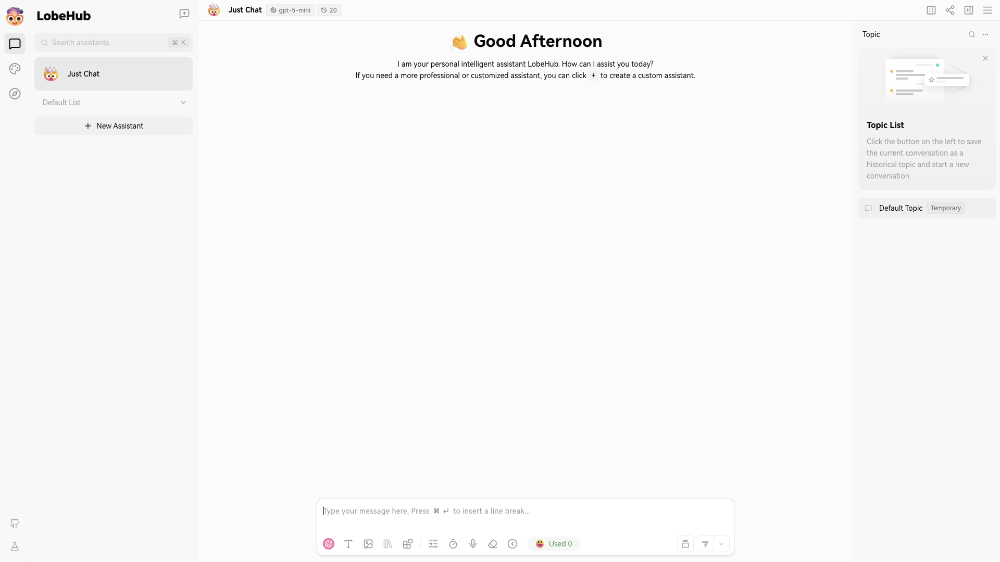

# LobeChat

Client-side AI chat UI supporting multiple LLM providers (OpenAI, Anthropic,
Google, Mistral, and more). Provider keys are configured in-browser, so the
instance starts chatting with no server-side setup.



## Usage

```bash
make docker-up
```

Open **http://localhost:3210**. The UI opens straight into a new chat — no login
or onboarding step. Configure LLM provider keys **client-side** in the app
(Settings → language model / provider).

> No auth gate by default: `ACCESS_CODE` is commented out in
> `docker-compose.yml`. Set it there (alongside provider keys) to
> password-protect the instance and preconfigure server-side keys.

## Services

| Container | Port(s) | Description |
|-----------|---------|-------------|
| **lobechat** | `3210` | LobeChat web application |

## Configuration

All variables are optional and set in the `environment:` section of
`docker-compose.yml` (commented out by default):

| Variable | Default | Notes |
|----------|---------|-------|
| `OPENAI_API_KEY` | — | Server-side OpenAI key; **change** for real use |
| `OPENAI_PROXY_URL` | — | Alternate OpenAI-compatible base URL |
| `ANTHROPIC_API_KEY` | — | Server-side Anthropic key |
| `ACCESS_CODE` | — | Password to protect the instance |

## Volumes

None — stateless. Provider keys and chat history live client-side in the
browser.

## Observability

| Check | Endpoint / Command |
|-------|--------------------|
| Web UI | `curl -I http://localhost:3210` |
| Logs | `docker compose logs -f lobechat` |

## Resources

- GitHub: https://github.com/lobehub/lobe-chat
- Docs: https://lobehub.com/docs
