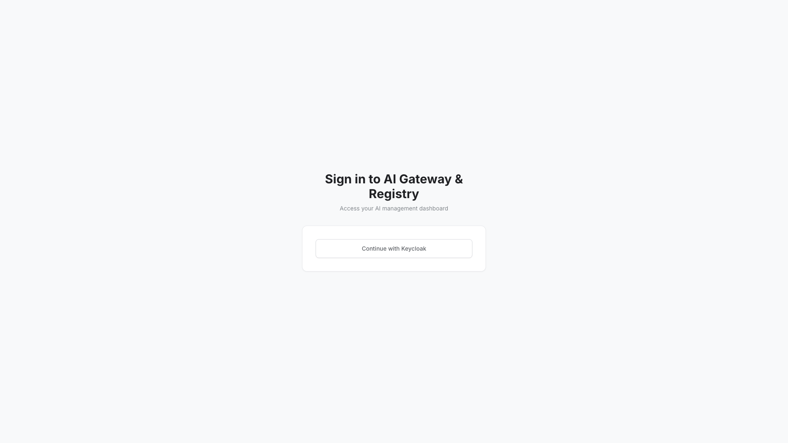

# MCP Gateway & Registry

A governed control plane for MCP servers, AI agents, skills, and custom AI
assets. It combines an **nginx reverse-proxy gateway**, a **FastAPI registry +
web UI**, and a separate **OAuth/OIDC auth server** into a single entry point:
one secure gateway URL fronting many MCP servers, with centralized discovery,
access control, semantic search, and audit.

This stack uses the upstream **pre-built images** published to Amazon ECR Public
(`public.ecr.aws/p3v1o3c6`) — no build from source required. It mirrors the
official `docker-compose.prebuilt.yml`, adapted to ysandbox conventions (state
under `.docker/`, registry UI on host `7860`).



## Usage

```bash
make docker-up
```

Open **http://localhost:7860** — the **AI Gateway & Registry** UI. First run
pulls several GB of images (the registry bundles nginx + FastAPI +
sentence-transformers) and seeds MongoDB, so allow a few minutes; the registry
reports `healthy` once nginx has reloaded a valid config.

- **Login:** the landing page offers **"Continue with Keycloak"** (OIDC). Out of
  the box the `mcp-gateway` realm is empty, so signing in requires provisioning
  it first (see Configuration). Unauthenticated pages render fine without it;
  `/api/*` returns `401` until you log in.
- **Keycloak admin console:** http://localhost:8080 — `admin` /
  `sandbox-keycloak-admin` (`KEYCLOAK_ADMIN_PASSWORD`), master realm.
- **Grafana:** http://localhost:3000 — `admin` / `sandbox-grafana-admin`.

<details>
<summary>API examples</summary>

```bash
# Poll the UI until it serves (200 once nginx reloads a valid config)
curl -sf -o /dev/null -w '%{http_code}\n' http://localhost:7860
```

</details>

> **Docker socket is NOT mounted** by this tracked compose (unlike the upstream
> build-from-source variant, which mounts `/var/run/docker.sock` so the registry
> can launch demo MCP-server containers). If you re-introduce that mount, note a
> Docker-socket mount is host-root-equivalent **even when `:ro`**.
>
> **ECR Public rate-limits anonymous pulls**, so the first `up` may need a retry
> or two. The demo MCP servers (`currenttime`, `realserverfaketools`) and the
> standalone `metrics-service` are not published to ECR and are omitted here.
>
> **MongoDB:** `mongo:8.2` (the compose default) boots healthy on OrbStack
> (kernel 7.x) — it did not hit the AVX/"Illegal instruction" crash
> (SERVER-121912) seen on some tags. If a future tag crash-loops, pin
> `MONGODB_VERSION` to a known-good build (e.g. `8.0.4`).

## Services

| Container | Port(s) | Description |
|-----------|---------|-------------|
| **registry** | `7860` (HTTP), `8443` (HTTPS) | nginx gateway + FastAPI registry + web UI (bundles embeddings) |
| **auth-server** | `127.0.0.1:8888` | OAuth/OIDC broker + token minting |
| **mcpgw-server** | `127.0.0.1:8003` | `mcpgw` MCP server exposing registry tools |
| **mongodb** | `127.0.0.1:27017` | MongoDB `8.2` storage + semantic search (replica set `rs0`, `--auth`) |
| **mongodb-keyfile-init** | — | One-shot: generates the replica-set keyfile |
| **mongodb-init** | — | One-shot: creates replica set, indexes, seeds admin scopes |
| **openbao** | `127.0.0.1:8200` | Per-user egress credential vault (dev mode, in-memory) |
| **keycloak** | `127.0.0.1:8080` | Identity provider (OIDC) |
| **keycloak-db** | — | PostgreSQL `16` — Keycloak backing store |
| **prometheus** | `127.0.0.1:9090` | Scrapes OTel-native metrics (`:9464`) from core services |
| **grafana** | `127.0.0.1:3000` | Dashboards over Prometheus |
| **pingfederate** | `127.0.0.1:9031`, `9999` | Optional alternative IdP (disabled; `pingfederate` profile) |

Loopback ports bind to `${HOST_BIND_IP:-127.0.0.1}`; set `HOST_BIND_IP=0.0.0.0`
to expose them. HTTPS on `8443` is **not** served out of the box — it needs
certificates mounted into `/etc/ssl` on the `registry` service.

## Configuration

Sandbox-safe defaults live in `.env` (**change every secret before real use**):

| Variable | Default | Notes |
|----------|---------|-------|
| `SECRET_KEY` | `sandbox-…` | App signing key, **≥32 chars** — required |
| `AUTH_SERVER_NGINX_MARKER_SECRET` | `sandbox-…` | Shared nginx→auth marker, **≥32 chars**, identical in registry + auth-server — required |
| `DOCUMENTDB_USERNAME` / `DOCUMENTDB_PASSWORD` | `admin` / `sandbox-mongo-pass` | MongoDB root creds |
| `OPENBAO_TOKEN` | `dev-root-token` | Dev-mode vault root token |
| `AUTH_PROVIDER` / `KEYCLOAK_ENABLED` | `keycloak` / `true` | Identity provider selection |
| `KEYCLOAK_ADMIN` / `KEYCLOAK_ADMIN_PASSWORD` | `admin` / `sandbox-keycloak-admin` | Keycloak master-realm admin console |
| `KEYCLOAK_CLIENT_SECRET` / `KEYCLOAK_M2M_CLIENT_SECRET` | `sandbox-…` | OIDC client secrets |
| `GRAFANA_ADMIN_PASSWORD` | `sandbox-grafana-admin` | Grafana admin (required, no default) |
| `MCP_TELEMETRY_DISABLED` | `1` | Anonymous usage telemetry off |

Generate real secrets with `openssl rand -hex 32` (for `SECRET_KEY` and
`AUTH_SERVER_NGINX_MARKER_SECRET`).

**Auth / admin setup (first run):** for login to succeed you must provision the
`mcp-gateway` realm with the `mcp-gateway-web` / `mcp-gateway-m2m` clients and a
user — via the Keycloak admin console or by dropping a realm-export JSON into
`keycloak/import/`. Registry admin identities are seeded into MongoDB from
`scripts/registry-admins.json` / `scripts/mcp-registry-admin.json` by the
`mongodb-init` job. See the upstream docs for the full Keycloak bootstrap.

Static config is mounted read-only from the repo: `config/prometheus.yml`,
`config/grafana/{dashboards,datasources}/`, `config/federation.json`,
`scripts/init-mongodb-ce.py` + `scripts/*.json`, and
`keycloak/{themes,providers,import}/`.

## Volumes

| Path | Contents |
|------|----------|
| `.docker/mongodb/{data,config}/` | MongoDB data + config |
| `.docker/registry/{servers,agents,models,logs,security_scans,applog}/` | Registry state + logs |
| `.docker/auth/{logs,applog}/` | Auth-server logs |
| `.docker/mcpgw/applog/` | mcpgw-server logs |
| `.docker/keycloak-db/` | Keycloak PostgreSQL data |
| `.docker/prometheus/` | Prometheus TSDB |
| `.docker/grafana/` | Grafana data |
| `.docker/pingfederate/` | PingFederate instance data (profile) |
| `mongodb-keyfile` (named volume) | Shared replica-set keyfile (needs `chown 999`) |

Reset the stack with `docker compose down -v` and `rm -rf .docker`.

## Observability

| Check | Endpoint / Command |
|-------|--------------------|
| Registry UI | `curl -sf -o /dev/null -w '%{http_code}\n' http://localhost:7860` |
| Keycloak | `curl -f http://localhost:8080/health/ready` |
| MongoDB | `docker compose exec mongodb mongosh -u admin -p <pass> --authenticationDatabase admin --eval "db.adminCommand('ping')"` |
| OpenBao | `docker compose exec openbao bao status -address=http://127.0.0.1:8200` |
| Metrics | Prometheus http://localhost:9090 (scrapes `:9464` OTel endpoints) / Grafana http://localhost:3000 |
| Logs | `docker compose logs -f registry` |

## Resources

- GitHub: https://github.com/agentic-community/mcp-gateway-registry
- Docs: https://agentic-community.github.io/mcp-gateway-registry
