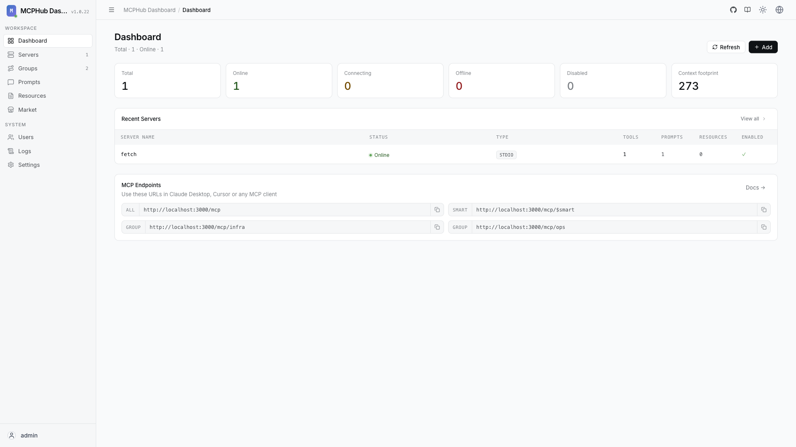

# MCPHub

Unified hub and gateway for multiple MCP (Model Context Protocol) servers.
Organizes servers into flexible Streamable HTTP/SSE endpoints — expose all
servers, individual servers, or logical groups — behind a single management
dashboard with hot-swappable configuration.



## Usage

```bash
make docker-up
```

Open **http://localhost:3000** and log in with username `admin` (password from
`ADMIN_PASSWORD`, default `admin`). Connect AI clients (Claude Desktop, Cursor,
etc.) to one of the aggregated endpoints:

```
http://localhost:3000/mcp           # All servers
http://localhost:3000/mcp/{group}   # Specific group
http://localhost:3000/mcp/{server}  # Specific server
http://localhost:3000/mcp/$smart    # Smart routing
```

> **Security:** MCP endpoints require bearer authentication by default. Disable
> it only in trusted local environments via the dashboard's Keys section.

## Services

| Container | Port(s) | Description |
|-----------|---------|-------------|
| **mcphub** | `3000` | MCPHub gateway + dashboard, aggregating the servers in `mcp_settings.json` |

## Configuration

MCP servers are declared in `mcp_settings.json`, mounted read/write at
`/app/mcp_settings.json`. The bundled example wires up a single `fetch` server:

```json
{
  "mcpServers": {
    "fetch": {
      "command": "uvx",
      "args": ["mcp-server-fetch"]
    }
  }
}
```

Add more servers (`command`/`args` for stdio, or `url` for remote) and MCPHub
picks them up without a restart.

| Variable | Default | Notes |
|----------|---------|-------|
| `ADMIN_PASSWORD` | `admin` | Dashboard admin password (`.env`); **change** for real use. If unset, a random password is generated and printed to the logs |

## Volumes

| Path | Contents |
|------|----------|
| `.docker/data/` | Accounts, keys, generated config |

## Observability

| Check | Endpoint / Command |
|-------|--------------------|
| Health | `curl http://localhost:3000/` (Compose probes this via `wget --spider`) |
| Logs | `docker compose logs -f mcphub` |

## Resources

- GitHub: https://github.com/samanhappy/mcphub
- Docs: https://mcphub.app
