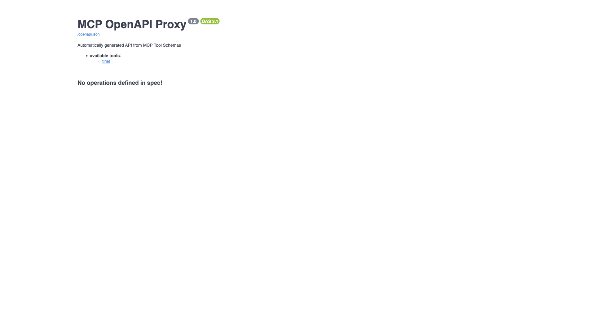

# mcpo

MCP-to-OpenAPI proxy by Open WebUI. Wraps one or more MCP (Model Context
Protocol) servers and exposes their tools as standard OpenAPI/REST HTTP
endpoints, auto-generating interactive OpenAPI docs. This stack wraps the
`mcp-server-time` demo server via a Claude-desktop-style `config.json`.



## Usage

```bash
make docker-up
```

Open the interactive Swagger UI at **http://localhost:8000/docs** (the UI loads
without auth). Each wrapped MCP server also gets its own sub-route and schema,
e.g. http://localhost:8000/time and http://localhost:8000/time/docs; the raw
schema is at http://localhost:8000/openapi.json. All **tool calls** require the
API key as a bearer token.

<details>
<summary>API examples</summary>

```bash
# Call the wrapped time tool (auth via the API key)
curl -X POST http://localhost:8000/time/get_current_time \
    -H "Authorization: Bearer top-secret" \
    -H "Content-Type: application/json" \
    -d '{"timezone": "Europe/Prague"}'
```

</details>

> **First boot needs outbound internet.** mcpo runs the wrapped server via
> `uvx`/`npx` at container **start**, so the first boot downloads the
> `mcp-server-time` package (a few seconds). The `/docs` endpoint returns 200
> once "Application startup complete" appears in the logs.
>
> **Port 8000 clash:** several ysandbox stacks publish host port 8000. To run
> mcpo alongside another, add a gitignored `docker-compose.override.yml`
> remapping the port with `ports: !override` (never committed).

## Services

| Container | Port(s) | Description |
|-----------|---------|-------------|
| **mcpo** | `8000` | MCP-to-OpenAPI proxy wrapping the `time` MCP server |

## Configuration

mcpo is started with `--config /app/config.json` (mounted read-only from
`./config.json`). The config follows the Claude Desktop format — an `mcpServers`
map where each entry is an MCP server launched by mcpo:

```json
{
  "mcpServers": {
    "time": {
      "command": "uvx",
      "args": ["mcp-server-time", "--local-timezone=Europe/Prague"]
    }
  }
}
```

| Variable | Default | Notes |
|----------|---------|-------|
| `MCPO_API_KEY` | `top-secret` | Bearer token required on every tool call (`.env`); **change** for real use |

Add more servers under `mcpServers` (e.g.
`npx -y @modelcontextprotocol/server-everything`); each is exposed under its own
route.

## Volumes

None — stateless. Only `config.json` is mounted (read-only).

## Observability

| Check | Endpoint / Command |
|-------|--------------------|
| Health | `curl http://localhost:8000/docs` (Compose probes this via `python` urllib) |
| Logs | `docker compose logs -f mcpo` |

## Resources

- GitHub: https://github.com/open-webui/mcpo
