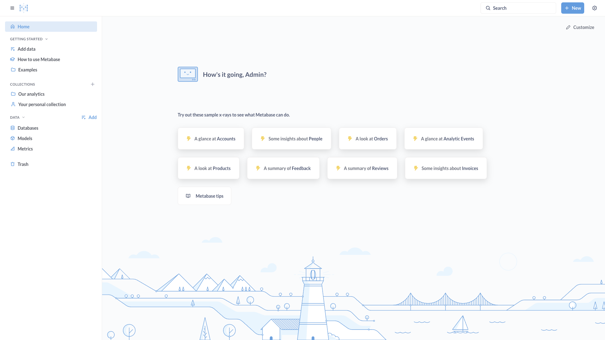

# Metabase Multi

Two fully independent Metabase instances, each backed by its own dedicated
PostgreSQL database. Useful for testing multi-tenant or side-by-side
configurations where two BI apps must not share application metadata.



## Usage

```bash
make docker-up
```

Each Metabase instance is a Clojure application that runs database migrations
on first boot, so allow up to a few minutes to become healthy:

- Instance 1: <http://localhost:3001>
- Instance 2: <http://localhost:3002>

On first launch each instance shows an interactive setup wizard (choose a
language, create the admin account, connect a database or use the bundled
sample data). The two instances are independent — run the wizard separately
for each. Poll readiness with:

```bash
curl -sf -o /dev/null -w '%{http_code}' http://localhost:3001/api/health   # 200 when ready
```

## Services

| Container | Port(s) | Description |
|-----------|---------|-------------|
| **metabase1** | `3001` | First Metabase instance (metadata in `postgres1`) |
| **postgres1** | — | PostgreSQL 17 for metabase1 application data |
| **metabase2** | `3002` | Second Metabase instance (metadata in `postgres2`) |
| **postgres2** | — | PostgreSQL 17 for metabase2 application data |

## Configuration

Environment variables set in `docker-compose.yml` (sandbox-safe defaults):

| Variable | Default | Notes |
|----------|---------|-------|
| `MB_DB_TYPE` | `postgres` | Metabase application database driver |
| `MB_DB_HOST` | `postgres1` / `postgres2` | Metadata database host |
| `MB_DB_DBNAME` | `metabase1` / `metabase2` | Metadata database name |
| `MB_DB_USER` | `metabase1` / `metabase2` | Database user — **change** for real use |
| `MB_DB_PASS` | `metabase1` / `metabase2` | Database password — **change** for real use |
| `POSTGRES_USER` | `metabase1` / `metabase2` | Postgres role (matches `MB_DB_USER`) |
| `POSTGRES_PASSWORD` | `metabase1` / `metabase2` | Postgres password — **change** for real use |
| `POSTGRES_DB` | `metabase1` / `metabase2` | Postgres database (matches `MB_DB_DBNAME`) |

## Volumes

| Path | Contents |
|------|----------|
| `.docker/postgres1/` | PostgreSQL data for metabase1 |
| `.docker/postgres2/` | PostgreSQL data for metabase2 |

## Observability

| Check | Endpoint / Command |
|-------|--------------------|
| Health (instance 1) | `curl -I http://localhost:3001/api/health` |
| Health (instance 2) | `curl -I http://localhost:3002/api/health` |
| Logs | `docker compose logs -f metabase1` |

## Resources

- GitHub: https://github.com/metabase/metabase
- Docs: https://www.metabase.com/docs/latest/
