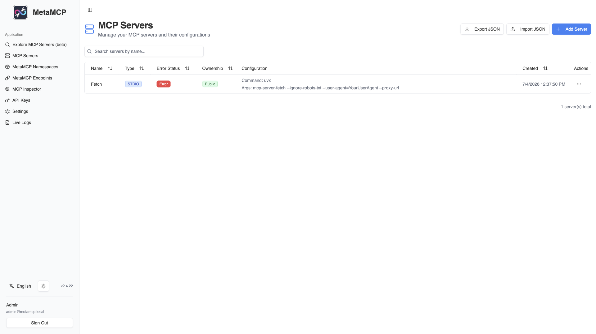

# MetaMCP

MCP proxy and aggregator with a web UI. Bundles multiple MCP servers behind
unified "MetaMCP" endpoints, organises them into namespaces, and layers
middleware (filtering, transforms) over the aggregated tool set. Backed by
PostgreSQL for persistence.



## Usage

```bash
make docker-up
```

Open <http://localhost:12008> — create an account on first visit, then build a
namespace and expose it as a unified MetaMCP endpoint:

1. Register **MCP Servers** (stdio or SSE/HTTP) in the UI.
2. Group one or more servers into a **Namespace**, optionally attaching
   middleware to filter or transform tools.
3. Publish the namespace as a **MetaMCP Endpoint** — a single aggregated URL
   under `http://localhost:12008/metamcp/<endpoint>` that any MCP client
   (Claude Desktop, Cursor, etc.) can connect to.

> **Secrets:** the defaults are sandbox-only. Before real use, regenerate both
> `BETTER_AUTH_SECRET` and `ENCRYPTION_KEY` with `openssl rand -hex 32`
> (`ENCRYPTION_KEY` must be 64 hex chars = AES-256).
>
> **Postgres clash:** this stack runs its own PostgreSQL. Do not run it
> alongside another ysandbox stack that publishes the same host port.

## Services

| Container | Port(s) | Description |
|-----------|---------|-------------|
| **app** | `12008` | MetaMCP Next.js web app, aggregator, and MCP endpoint server |
| **postgres** | — | PostgreSQL 16 for namespaces, endpoints, users, and config |

## Configuration

Environment variables in `.env` (sandbox-safe defaults):

| Variable | Default | Notes |
|----------|---------|-------|
| `BETTER_AUTH_SECRET` | `sandbox-...` | Session signing key — **change** |
| `ENCRYPTION_KEY` | `000...` (64 hex) | AES-256 key for stored secrets — **change** |
| `APP_URL` | `http://localhost:12008` | Public URL of the web UI |
| `NEXT_PUBLIC_APP_URL` | `http://localhost:12008` | Public URL baked into the frontend |
| `POSTGRES_USER` | `metamcp_user` | Database user |
| `POSTGRES_PASSWORD` | `m3t4mcp` | Database password — **change** |
| `POSTGRES_DB` | `metamcp_db` | Database name |
| `POSTGRES_HOST` | `postgres` | Database host |
| `POSTGRES_PORT` | `5432` | Database port |
| `TRANSFORM_LOCALHOST_TO_DOCKER_INTERNAL` | `true` | Rewrite host `localhost` MCP URLs to `host.docker.internal` |

`DATABASE_URL` is composed from the `POSTGRES_*` vars inside `docker-compose.yml`.

## Volumes

| Path | Contents |
|------|----------|
| `.docker/postgres/` | PostgreSQL data (namespaces, endpoints, users, config) |

## Observability

| Check | Endpoint / Command |
|-------|--------------------|
| Health | `curl -fsS http://localhost:12008/` |
| Logs | `docker compose logs -f app` |

## Resources

- GitHub: https://github.com/metatool-ai/metamcp
