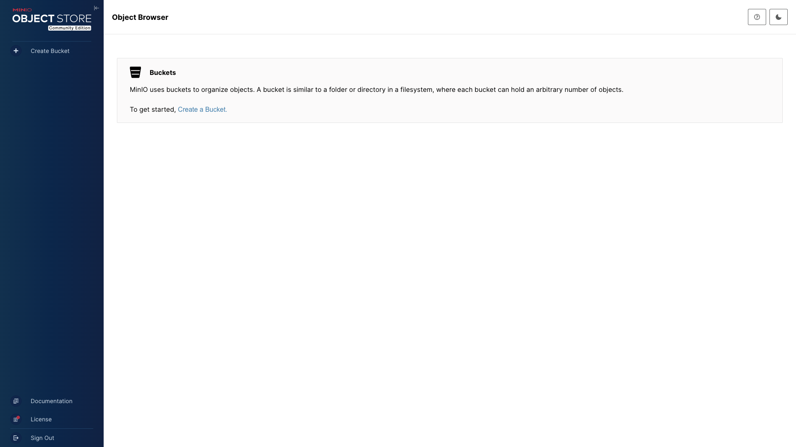

# MinIO

S3-compatible object storage server — a drop-in replacement for Amazon S3 with
a web console for bucket and object management. Useful as a local S3 backend
for apps, backups, or SDK testing.



## Usage

```bash
make docker-up
```

- Web **Console**: <http://localhost:9001> — log in with `minioadmin` /
  `minioadmin`. Use **Object Browser** / **Buckets** to create a bucket and
  upload objects.
- **S3 API** endpoint: <http://localhost:9000> — use with `mc`, the AWS SDKs,
  or any S3 client.

<details><summary>API examples</summary>

Using the MinIO client (`mc`):

```bash
mc alias set local http://localhost:9000 minioadmin minioadmin
mc mb local/my-bucket
mc cp myfile.txt local/my-bucket/
```

</details>

## Services

| Container | Port(s) | Description |
|-----------|---------|-------------|
| **minio** | `9000` (API), `9001` (console) | MinIO object storage server |

## Configuration

Environment variables in `docker-compose.yml` (sandbox-safe defaults):

| Variable | Default | Notes |
|----------|---------|-------|
| `MINIO_ROOT_USER` | `minioadmin` | Admin / access key — **change** for real use |
| `MINIO_ROOT_PASSWORD` | `minioadmin` | Admin / secret key — **change** for real use |

## Volumes

| Path | Contents |
|------|----------|
| `.docker/data/` | Object storage (buckets and objects) |

## Observability

| Check | Endpoint / Command |
|-------|--------------------|
| Health | `mc ready local` (container healthcheck) |
| Logs | `docker compose logs -f minio` |

## Resources

- GitHub: https://github.com/minio/minio
- Docs: https://min.io/docs/minio/container/index.html
