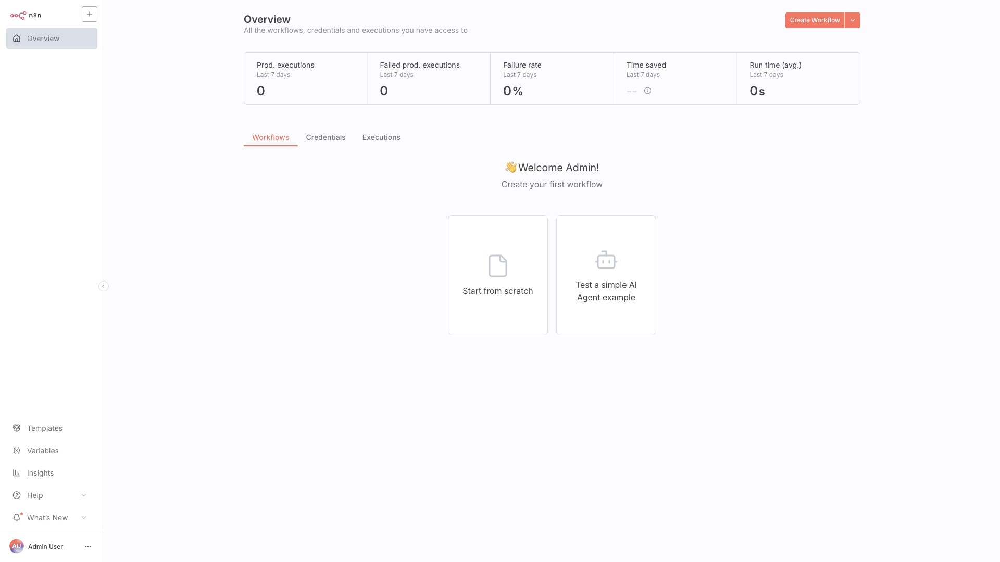

# n8n

Workflow automation platform to connect apps and services into complex
automations. Runs in **queue mode**: the editor and a separate worker share
PostgreSQL and Redis, with Qdrant available for AI/embedding workflows.



## Usage

```bash
make docker-up
```

- n8n editor: http://localhost:5678
- Adminer (DB UI): http://localhost:8000
- Qdrant REST: http://localhost:6333

First run is the **owner-account setup** — enter email, name, and a password
(min 8 characters, must include a number) to create the owner, then you land on
the Workflows overview.

## Services

| Container | Port(s) | Description |
|-----------|---------|-------------|
| **n8n** | `5678` | Main application server (web UI + API) |
| **n8n-worker** | — | Background worker for queue-based executions |
| **postgres** | `5433` → 5432 | PostgreSQL 16 storing n8n data |
| **redis** | `6380` | Redis cache + queue for distributed execution |
| **qdrant** | `6333` (REST), `6334` (gRPC) | Vector database for AI/embedding workflows |
| **adminer** | `8000` | Database management UI |

## Configuration

Key environment variables in `docker-compose.yml`:

| Variable | Default | Notes |
|----------|---------|-------|
| `EXECUTIONS_MODE` | `queue` | Offloads manual/heavy executions to `n8n-worker` |
| `N8N_BASIC_AUTH_ACTIVE` | `false` | Basic auth disabled — the owner account is the only gate |

Host ports are remapped to avoid clashes (Postgres `5433`, Redis `6380`); the
services still use standard ports inside the compose network.

## Volumes

| Path | Contents |
|------|----------|
| `.docker/n8n/` | n8n config and user files |
| `.docker/postgres/` | PostgreSQL database |
| `.docker/redis/` | Redis persistence |
| `.docker/qdrant/` | Vector database storage |

## Observability

| Check | Endpoint / Command |
|-------|--------------------|
| Health | `curl http://localhost:5678/healthz` |
| Postgres | `docker compose exec postgres pg_isready -U n8n` |
| Redis | `docker compose exec redis redis-cli ping` |
| Logs | `docker compose logs -f n8n n8n-worker` |

## Resources

- GitHub: https://github.com/n8n-io/n8n
- Docs: https://docs.n8n.io
