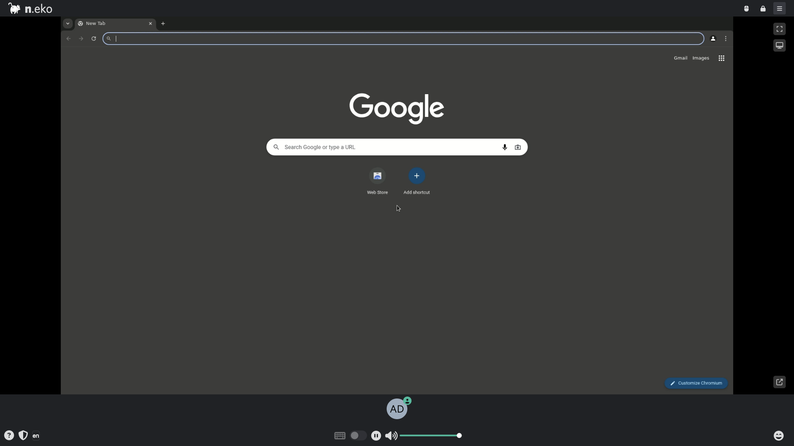

# Neko Browser

Neko streams a remote Chromium desktop to your browser over WebRTC, with a
virtual display and shared multi-user control. Useful for interactive remote
browsing or as a base for CDP-driven automation against the exposed Chrome
DevTools Protocol port.



## Usage

```bash
make docker-up
```

- Open <http://localhost:8080> and connect with a display name plus a password.
  - **User:** `neko` (from `NEKO_MEMBER_MULTIUSER_USER_PASSWORD`)
  - **Admin:** `admin` (from `NEKO_MEMBER_MULTIUSER_ADMIN_PASSWORD`)
- The desktop and Chromium stream over WebRTC; the first frame appears a few
  seconds after connecting.
- Chrome DevTools Protocol is published on port `9223` for CDP-based automation
  (e.g. `chromium.connectOverCDP('http://0.0.0.0:9223')`).

Bring the stack down with `docker compose down`.

> **`NEKO_CHROME_FLAGS` is required.** The image's supervisord `chromium.conf`
> interpolates `%(ENV_NEKO_CHROME_FLAGS)s`. If unset, supervisord fails to
> expand the format string and Chromium crash-loops (the container stays in
> `Restarting` and port 8080 never binds). It is defined (empty) in
> `docker-compose.yml`; append extra Chromium flags there if needed.
>
> **Port clash.** Host port 8080 is shared with other ysandbox stacks. To run
> two at once, add a gitignored `docker-compose.override.yml` remapping the
> published port with `ports: !override` — do not commit it.

## Services

| Container | Port(s) | Description |
|-----------|---------|-------------|
| **neko** | `8080` (UI), `9223` (CDP), `56000-56100/udp` (WebRTC) | Remote Chromium desktop with WebRTC streaming |

## Configuration

Environment variables in `docker-compose.yml` (sandbox-safe defaults):

| Variable | Default | Notes |
|----------|---------|-------|
| `NEKO_DESKTOP_SCREEN` | `1920x1080@30` | Virtual display resolution and refresh rate |
| `NEKO_MEMBER_MULTIUSER_USER_PASSWORD` | `neko` | Regular-user room password — **change** |
| `NEKO_MEMBER_MULTIUSER_ADMIN_PASSWORD` | `admin` | Admin room password — **change** |
| `NEKO_WEBRTC_EPR` | `56000-56100` | WebRTC UDP media port range |
| `NEKO_WEBRTC_NAT1TO1` | `127.0.0.1` | Advertised ICE candidate; set to host's reachable IP for remote access |
| `NEKO_WEBRTC_ICELITE` | `1` | Run Neko as an ICE-lite peer |
| `NEKO_DESKTOP_UNMINIMIZE` | `true` | Auto-unminimize windows |
| `NEKO_DESKTOP_UPLOAD_DROP` | `true` | Allow drag-and-drop file upload |
| `NEKO_CHROME_FLAGS` | `""` | Extra Chromium flags (must stay defined — see note above) |

## Volumes

| Path | Contents |
|------|----------|
| `.docker/chrome/` | Chromium profile / config |

## Observability

| Check | Endpoint / Command |
|-------|--------------------|
| Logs | `docker compose logs -f neko` |

## Resources

- GitHub: https://github.com/m1k1o/neko
- Docs: https://neko.m1k1o.net/
