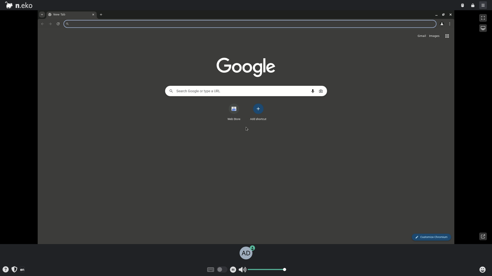

# Neko + Playwright

Neko streams a remote Chromium desktop over WebRTC while Playwright — running
on the **host** — drives that same browser over the Chrome DevTools Protocol.
Lets you watch and script an automated session in real time.



## Usage

```bash
make docker-up
```

- Open <http://localhost:8080> and connect with a display name.
  - **User:** `neko` (from `NEKO_MEMBER_MULTIUSER_USER_PASSWORD`)
  - **Admin:** `admin` (from `NEKO_MEMBER_MULTIUSER_ADMIN_PASSWORD`)
- The room UI streams a live Chromium desktop over WebRTC.

Playwright runs on the host (not as a compose service) and attaches to the neko
Chromium over CDP on port `9223`:

```ts
const browser = await chromium.connectOverCDP('http://0.0.0.0:9223');
```

Install and run the tests locally:

```bash
make install   # npm install && npx playwright install
make test      # npx playwright test
```

Bring the stack down with `docker compose down`.

> **Chromium crash-loop fix.** The stock `dockette/neko:chromium` supervisord
> config references `%(ENV_NEKO_CHROME_FLAGS)s`. If that variable is unset,
> supervisord fails to expand the format string, Chromium never starts, the
> container sits in `Restarting`, and port 8080 stays unbound. Setting
> `NEKO_CHROME_FLAGS: ""` (empty) in `docker-compose.yml` resolves it.
>
> **Host port 8080** is not globally unique in ysandbox. If another stack holds
> 8080, add a gitignored `docker-compose.override.yml` remapping the host port
> (`ports: !override`) before bringing this stack up.

## Services

| Container | Port(s) | Description |
|-----------|---------|-------------|
| **neko** | `8080` (UI), `9223` (CDP), `56000-56100/udp` (WebRTC) | Remote Chromium desktop with WebRTC streaming, driven by host Playwright over CDP |

## Configuration

Environment variables in `docker-compose.yml` (sandbox-safe defaults):

| Variable | Default | Notes |
|----------|---------|-------|
| `NEKO_DESKTOP_SCREEN` | `1920x1080@30` | Virtual display resolution and refresh rate |
| `NEKO_MEMBER_MULTIUSER_USER_PASSWORD` | `neko` | Regular-user room password — **change** |
| `NEKO_MEMBER_MULTIUSER_ADMIN_PASSWORD` | `admin` | Admin room password — **change** |
| `NEKO_WEBRTC_EPR` | `56000-56100` | WebRTC UDP media port range |
| `NEKO_WEBRTC_NAT1TO1` | `127.0.0.1` | Advertised ICE candidate; set to host's reachable IP for remote access |
| `NEKO_WEBRTC_ICELITE` | `1` | Run Neko as an ICE-lite peer |
| `NEKO_DESKTOP_UNMINIMIZE` | `true` | Auto-unminimize windows |
| `NEKO_DESKTOP_UPLOAD_DROP` | `true` | Allow drag-and-drop file upload |
| `NEKO_CHROME_FLAGS` | `""` | Extra Chromium flags (must stay defined — see note above) |

## Volumes

| Path | Contents |
|------|----------|
| `.docker/chrome/` | Chromium profile / config |

## Observability

| Check | Endpoint / Command |
|-------|--------------------|
| Logs | `docker compose logs -f neko` |

## Resources

- GitHub: https://github.com/m1k1o/neko
- Docs: https://neko.m1k1o.net/
- Playwright: https://playwright.dev/
