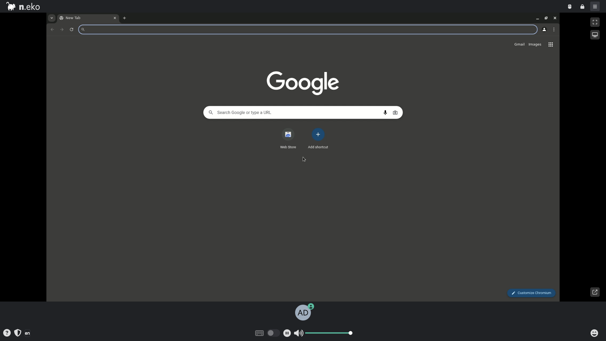

# Neko + Stagehand

Neko streams a remote Chromium desktop over WebRTC while Stagehand — an
AI-driven browser automation library running on the **host** — drives that same
browser over the Chrome DevTools Protocol. Lets you watch AI-controlled
sessions live.



## Usage

```bash
make docker-up
```

- Open <http://localhost:8080> and connect with a display name.
  - **User:** `neko` (from `NEKO_MEMBER_MULTIUSER_USER_PASSWORD`)
  - **Admin:** `admin` (from `NEKO_MEMBER_MULTIUSER_ADMIN_PASSWORD`)
- The room UI streams a live Chromium desktop over WebRTC.

Stagehand runs on the host (`tsx index.ts`) in `LOCAL` env and attaches to the
neko-managed Chromium over CDP at `http://0.0.0.0:9223` (published container
port `9223`), recording video to `./videos`. Provide model credentials via
`.env` (see `.env.example`) before running:

```bash
cp .env.example .env   # set OPENAI_API_KEY / OPENAI_BASE_URL or GOOGLE_API_KEY
make install           # npm install
make test              # tsx index.ts
```

Bring the stack down with `docker compose down`.

> **Boot fix:** `dockette/neko:chromium`'s supervisord config references
> `%(ENV_NEKO_CHROME_FLAGS)s`. When that variable is unset, supervisord fails to
> expand it and the container crash-loops (`Restarting`), leaving port 8080
> unbound. The compose sets `NEKO_CHROME_FLAGS: ""` (empty) to satisfy the
> interpolation and let Chromium start.
>
> **Port 8080** is shared with the other `neko-*` sandbox stacks — only run one
> at a time. To coexist during testing, add a gitignored
> `docker-compose.override.yml` remapping the host port (`ports: !override`).

## Services

| Container | Port(s) | Description |
|-----------|---------|-------------|
| **neko** | `8080` (UI), `9223` (CDP), `56000-56100/udp` (WebRTC) | Remote Chromium desktop with WebRTC streaming, driven by host Stagehand over CDP |

## Configuration

Neko environment variables in `docker-compose.yml` (sandbox-safe defaults):

| Variable | Default | Notes |
|----------|---------|-------|
| `NEKO_DESKTOP_SCREEN` | `1920x1080@30` | Virtual display resolution and refresh rate |
| `NEKO_MEMBER_MULTIUSER_USER_PASSWORD` | `neko` | Regular-user room password — **change** |
| `NEKO_MEMBER_MULTIUSER_ADMIN_PASSWORD` | `admin` | Admin room password — **change** |
| `NEKO_WEBRTC_EPR` | `56000-56100` | WebRTC UDP media port range |
| `NEKO_WEBRTC_NAT1TO1` | `127.0.0.1` | Advertised ICE candidate; set to host's reachable IP for remote access |
| `NEKO_WEBRTC_ICELITE` | `1` | Run Neko as an ICE-lite peer |
| `NEKO_DESKTOP_UNMINIMIZE` | `true` | Auto-unminimize windows |
| `NEKO_DESKTOP_UPLOAD_DROP` | `true` | Allow drag-and-drop file upload |
| `NEKO_CHROME_FLAGS` | `""` | Extra Chromium flags (must stay defined — see note above) |

Host-side Stagehand credentials in `.env` (see `.env.example`):

| Variable | Default | Notes |
|----------|---------|-------|
| `OPENAI_API_KEY` | — | OpenAI model key — **change** for real use |
| `OPENAI_BASE_URL` | — | Optional OpenAI-compatible endpoint |
| `GOOGLE_API_KEY` | — | Alternative Google model key |

## Volumes

| Path | Contents |
|------|----------|
| `.docker/chrome/` | Chromium profile / config |

## Observability

| Check | Endpoint / Command |
|-------|--------------------|
| Logs | `docker compose logs -f neko` |

## Resources

- GitHub: https://github.com/m1k1o/neko
- Docs: https://neko.m1k1o.net/
- Stagehand: https://github.com/browserbase/stagehand
