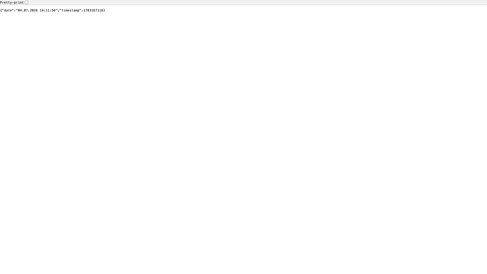

# Nginx + PHP-FPM

A custom-built container running Nginx 1.22 in front of PHP-FPM 8.1, serving a
minimal PHP app. Demonstrates a PHP-FPM-over-unix-socket setup plus an optional
in-container caching reverse proxy. Originally from f3l1x's Nginx Cookbook.



## Usage

This stack is **build-based** — there is no `docker-compose.yml`. Build the
image from the `Dockerfile` (custom Nginx 1.22 + PHP-FPM 8.1) and run it,
publishing the app server on host port `8080`:

```bash
docker build -t nginx-php .
docker run --rm -p 8080:80 nginx-php
```

- Open <http://localhost:8080> — Nginx passes `.php` requests to PHP-FPM over a
  unix socket and serves `app/index.php`, which returns a JSON payload
  (`{"date": "...", "timestamp": ...}`). No authentication.
- The container also listens on `81` internally — a caching reverse proxy in
  front of `:80` (proxy cache with stale-while-revalidate, adds an
  `x-cache-status` header). Publish it too with an extra `-p 8081:81` to
  exercise the cache layer.

> **Build required first.** There is no pre-built image; run `docker build`
> (above) before `docker run`. If you wrap this in a Compose file, use
> `docker compose build` / `docker compose up --build`.
>
> **Stale Makefile.** The bundled `Makefile` targets (`build-app` / `up-app`)
> reference an old `01-app/` layout and do not match the current single-app
> structure — build the `Dockerfile` directly as shown above.

## Services

| Container | Port(s) | Description |
|-----------|---------|-------------|
| **nginx-php** | `8080` → `:80` (app), `:81` internal (cache proxy) | Nginx serving `app/index.php` via PHP-FPM, with an optional caching proxy on `:81` |

## Configuration

No runtime environment variables — configuration is baked into the image at
build time:

| Setting | Value | Notes |
|---------|-------|-------|
| Nginx version | `1.22.0` | Installed in the `Dockerfile` |
| PHP version | `8.1` (CLI + FPM) | `php8.1-fpm`, served over unix socket |
| Timezone / locale | `Europe/Prague`, `en_US.UTF-8` | Set in the `Dockerfile` |
| Nginx config | `nginx/nginx.conf`, `nginx/site.conf` | App on `:80`, cache proxy on `:81` |

## Volumes

None — stateless. The app is copied into the image at build time (`ADD app /srv`).

## Observability

| Check | Endpoint / Command |
|-------|--------------------|
| App response | `curl http://localhost:8080` |
| Cache status | `curl -i http://localhost:8081` (look for `x-cache-status`, needs `-p 8081:81`) |
| Logs | `docker logs -f <container>` (Nginx access/error stream to stdout/stderr) |

## Resources

- GitHub: https://github.com/f3l1x/nginx
- Author: https://f3l1x.io
