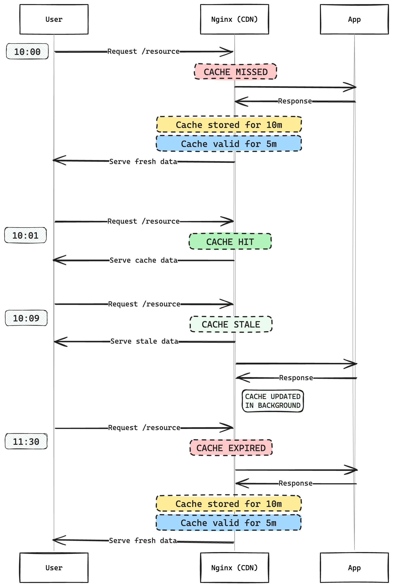

# Nginx + Proxy

- Nginx on [`http://localhost:8080`](http://localhost:8080)
- App on [`http://localhost:3000`](http://localhost:3000)

## Usage

```
docker compose up
```

## Configuration

**Proxy**

```
# nginx.conf
server {
    listen 80;

    # Swift
    location ~ ^/debug/(?<account>[^/]+)/(?<container>[^/]+)/(?<file>[^/]+)$ {
        proxy_set_header Host $host;
        proxy_set_header X-Token "Test";
        proxy_set_header Accept "*/*";
        proxy_pass http://app/v1/AUTH_$account/$container/$file;
    }

    # Index
    location / {
        proxy_pass http://app;
    }
}
```

## Architecture



## Examples

1. Request

```
❯ curl -i http://localhost:8080/
{"url":"http://app/","headers":{"host":"app","connection":"close","user-agent":"curl/8.7.1","accept":"*/*"},"method":"GET"}
```
