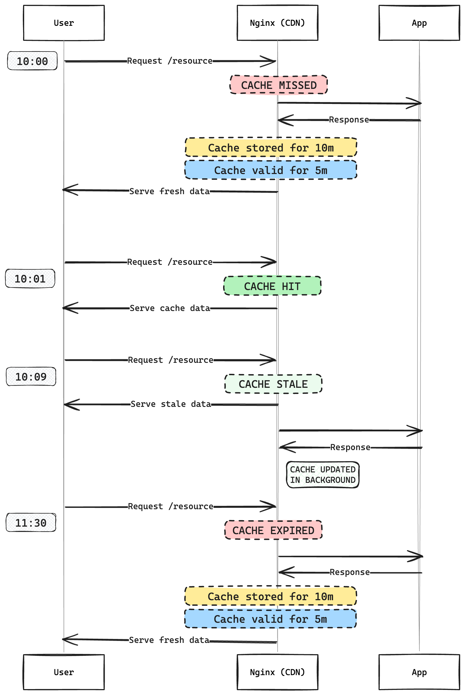

# Nginx + Proxy

- Nginx on [`http://localhost:8080`](http://localhost:8080)
- App1 on [`http://localhost:3001`](http://localhost:3001)
- App2 on [`http://localhost:3002`](http://localhost:3002)

## Usage

```
docker compose up
```

## Configuration

**Proxy**

```
# nginx.conf
server {
    listen 80;

    # Index
    location / {
        proxy_pass http://app;
    }
}
```

## Architecture



## Examples

```
❯ curl localhost:8080/foo/bar/xx/image.png
{"url":"http://localhost/v1/AUTH_myaccount/foo-bar-xx/image.png","headers":{"host":"localhost","connection":"close","user-agent":"curl/8.7.1","accept":"*/*","x-real-ip":"192.168.147.1","x-forwarded-for":"192.168.147.1","x-forwarded-proto":"http"},"method":"GET"}
```
