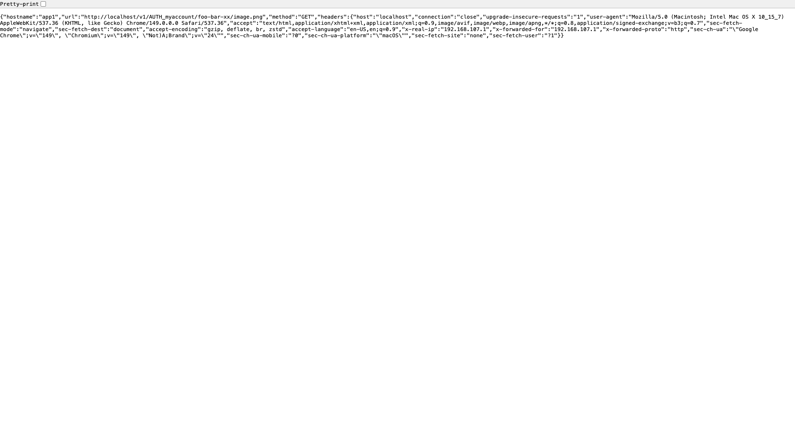

# Nginx + Proxy

An Nginx reverse proxy in front of two round-robined Bun.js app instances.
Demonstrates path rewriting, forwarded client headers, and upstream
identification — a compact playground for proxy behaviour.



## Usage

```bash
make docker-up
```

- Nginx reverse proxy: <http://localhost:8080>
- App instances directly: <http://localhost:3001> (app1), <http://localhost:3002> (app2)

The root `/` returns `404` by design (`@handle_404`); hit a demo path with one
or more segments to exercise the proxy, e.g.
<http://localhost:8080/foo/bar/xx/image.png>.

What the proxy does:

- **Path rewrite** — incoming multi-segment paths are collapsed into a
  Swift-style object path before `proxy_pass`, e.g.
  `foo/bar/xx/image.png` → `/v1/AUTH_myaccount/foo-bar-xx/image.png`.
- **Forwarded client headers** — sets `X-Real-IP`, `X-Forwarded-For`, and
  `X-Forwarded-Proto` (echoed in the Bun app's JSON response).
- **Upstream identification** — adds an `X-Host` response header set to
  `$upstream_addr` (the backend `ip:port` that served the request), useful for
  seeing which app instance handled a call.

> The `X-Host` header uses the built-in `$upstream_addr` variable. An earlier
> version used the undefined `$upstream_server`, which made nginx fail to start
> with `[emerg] unknown "upstream_server" variable` (port 8080 never came up).

<details><summary>API examples</summary>

```bash
❯ curl localhost:8080/foo/bar/xx/image.png
{"url":"http://localhost/v1/AUTH_myaccount/foo-bar-xx/image.png","headers":{"host":"localhost","connection":"close","user-agent":"curl/8.7.1","accept":"*/*","x-real-ip":"192.168.147.1","x-forwarded-for":"192.168.147.1","x-forwarded-proto":"http"},"method":"GET"}
```

</details>

## Services

| Container | Port(s) | Description |
|-----------|---------|-------------|
| **nginx** | `8080` → `:80` | Reverse proxy round-robining app1/app2 |
| **app1** | `3001` → `:3000` | Bun.js echo app instance |
| **app2** | `3002` → `:3000` | Bun.js echo app instance |

## Configuration

Environment variables in `docker-compose.yml`:

| Variable | Default | Notes |
|----------|---------|-------|
| `SERVICE_NAME` | `app1` / `app2` | Identifies each Bun app instance |

Proxy behaviour is defined in `nginx/nginx.conf`; the Bun app is `app/server.js`
(both bind-mounted read-only into the containers).

## Volumes

None — stateless. `nginx/nginx.conf` and `app/server.js` are bind-mounted
config, not persistent state.

## Observability

| Check | Endpoint / Command |
|-------|--------------------|
| Proxy response | `curl -i http://localhost:8080/foo/bar/xx/image.png` (check `X-Host`) |
| Logs | `docker compose logs -f nginx` |

## Resources

- Nginx docs: https://nginx.org/en/docs/
- Bun docs: https://bun.sh/docs
