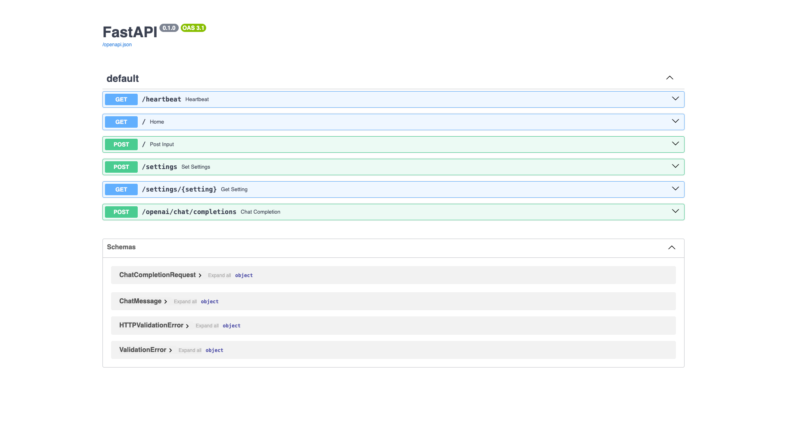

# Open Interpreter

Code-executing AI agent exposed over a WebSocket and an OpenAI-compatible HTTP
API. Runs model-generated code inside the container and streams results back.
Custom local build (FastAPI wrapper around Open Interpreter).



## Usage

This is a local `build:` stack, so it must be built before the first run:

```bash
make docker-up
# or, to force a rebuild:
docker compose up -d --build
```

Set an LLM API key in `.env` first (`OPENAI_API_KEY=sk-...` or
`ANTHROPIC_API_KEY=...`). Then verify:

```bash
curl http://localhost:8000/heartbeat   # {"status":"alive"}
open http://localhost:8000/docs         # interactive Swagger UI
```

> The image compiles the `psutil` C extension at build time (no prebuilt
> aarch64 wheel for the pinned version), so the first build takes a minute or
> two. The Dockerfile sets `INTERPRETER_HOST=0.0.0.0` so the published port is
> reachable from the host — plain `HOST` is ignored.

<details><summary>API examples</summary>

- `GET  /` — minimal HTML chat client that talks to the WebSocket
- `WS   /` — WebSocket stream for chat, code approval, and auth
- `GET  /heartbeat` — liveness probe, returns `{"status":"alive"}`
- `GET  /docs` — Swagger UI (shown in the screenshot)
- `POST /openai/chat/completions` — OpenAI-compatible chat completion
- `POST /settings`, `GET /settings/{setting}` — read/update interpreter settings

```bash
curl http://localhost:8000/heartbeat
```

</details>

## Services

| Container | Port(s) | Description |
|-----------|---------|-------------|
| **open-interpreter** | `8000` | FastAPI server (WebSocket + OpenAI-compatible HTTP), custom local build |

## Configuration

Environment variables in `.env`:

| Variable | Default | Notes |
|----------|---------|-------|
| `OPENAI_API_KEY` / `ANTHROPIC_API_KEY` | — | LLM provider key; **change** — required for any real chat/code call |
| `INTERPRETER_REQUIRE_ACKNOWLEDGE` | `True` | Require confirmation before executing code |
| `INTERPRETER_AUTO_RUN` | `False` | Auto-run code without prompting |

> The server boots and serves all HTTP routes without a key, but any actual
> chat/code-execution call needs a provider key set in `.env`.

## Volumes

None — stateless. No `.docker/*` bind mounts; the container holds no persisted
state.

## Observability

| Check | Endpoint / Command |
|-------|--------------------|
| Health | `curl http://localhost:8000/heartbeat` |
| API docs | `http://localhost:8000/docs` |
| Logs | `docker compose logs -f open-interpreter` |

## Resources

- GitHub: https://github.com/OpenInterpreter/open-interpreter
- Docs: https://docs.openinterpreter.com
