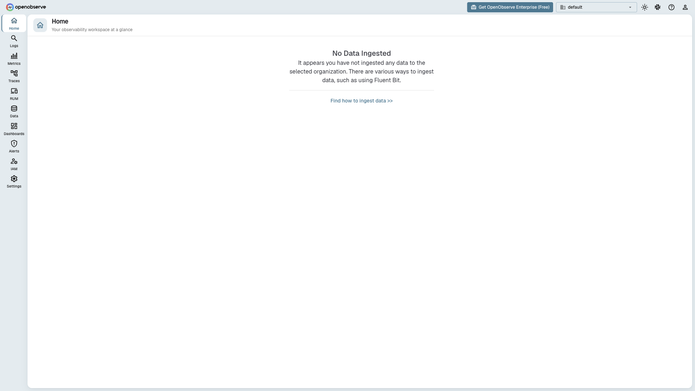

# OpenObserve

Open-source observability platform for logs, metrics, and traces. Ships a web UI
plus REST/OTLP ingestion endpoints, and stores data on local disk.



## Usage

```bash
make docker-up
```

Open [`http://localhost:5080`](http://localhost:5080) and log in as the root
user (`ZO_ROOT_USER_EMAIL` / `ZO_ROOT_USER_PASSWORD`). With the compose
defaults that is `admin@example.com` / `admin123`; a local `.env` can override
these. Then explore **Logs**, **Metrics**, and **Traces** and grab ingestion
snippets from the UI.

<details><summary>API examples</summary>

```bash
# Push logs via the JSON ingestion API
curl -u admin@example.com:admin123 \
  -X POST http://localhost:5080/api/default/my-stream/_json \
  -H "Content-Type: application/json" \
  -d '[{"level":"info","message":"hello openobserve"}]'
```

```bash
# OTLP exporter env for traces / metrics / logs
OTEL_EXPORTER_OTLP_ENDPOINT=http://localhost:5080/api/default/
OTEL_EXPORTER_OTLP_HEADERS="Authorization=Basic $(echo -n 'admin@example.com:admin123' | base64)"
```

</details>

## Services

| Container | Port(s) | Description |
|-----------|---------|-------------|
| **openobserve** | `5080` | OpenObserve server — web UI and HTTP/OTLP ingestion + REST API |

## Configuration

Environment variables (compose defaults, overridable via `.env`):

| Variable | Default | Notes |
|----------|---------|-------|
| `ZO_ROOT_USER_EMAIL` | `admin@example.com` | Root user email |
| `ZO_ROOT_USER_PASSWORD` | `admin123` | Root user password; **change** for real use |
| `ZO_DATA_DIR` | `/data` | In-container data path (bind-mounted to `.docker/openobserve/`) |
| `ZO_TELEMETRY` | `false` | Usage telemetry opt-out |

## Volumes

| Path | Contents |
|------|----------|
| `.docker/openobserve/` | Ingested logs/metrics/traces and OpenObserve metadata |

## Observability

| Check | Endpoint / Command |
|-------|--------------------|
| Health | `curl http://localhost:5080/healthz` |
| Logs | `docker compose logs -f openobserve` |

## Resources

- GitHub: https://github.com/openobserve/openobserve
- Docs: https://openobserve.ai/docs
