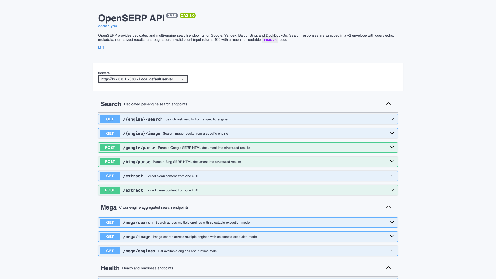

# OpenSERP

Search engine results API. Fetches results from Google, Yandex, Baidu, Bing, and
DuckDuckGo and returns them as JSON over a REST API, driving a headless Chromium
per engine.



## Usage

```bash
make docker-up
```

- Interactive Swagger UI: `http://localhost:7000/docs` (the root path `/`
  returns `404` — use `/docs`). The OpenAPI spec is at `/openapi.yaml`.
- Health: `curl http://localhost:7000/health` → `200`.

> **macOS host-port clash.** The macOS AirPlay Receiver binds host port `7000`
> and answers with an `AirTunes` `403`. This stack ships a committed
> `docker-compose.override.yml` remapping the host port to `7070`
> (`ports: !override` → `"7070:7000"`), so on macOS reach it at
> `http://localhost:7070` instead. Either disable AirPlay Receiver or keep the
> override.

> **Live search needs a working browser backend.** Engines drive a headless
> Chromium; under `linux/amd64` emulation on Apple Silicon a search may return
> `{"error":"engine_internal","code":502, ... browser connect failed}`. The
> server itself still boots healthy and the Swagger UI renders.

<details><summary>API examples</summary>

```bash
# Google search
curl "http://localhost:7000/google/search?text=hello+world&lang=en"

# Multi-engine search
curl "http://localhost:7000/mega/search?text=hello+world"

# Image search
curl "http://localhost:7000/google/image?text=cats"
```

</details>

## Services

| Container | Port(s) | Description |
|-----------|---------|-------------|
| **openserp** | `7000` (host `7070` via committed override) | OpenSERP REST API + Swagger UI, backed by headless Chromium |

## Configuration

No `.env` — the server is configured via the `command:` in `docker-compose.yml`
(`serve -a 0.0.0.0 -p 7000`). No sandbox secrets.

## Volumes

None — stateless.

## Observability

| Check | Endpoint / Command |
|-------|--------------------|
| Health | `curl http://localhost:7000/health` |
| API docs | `http://localhost:7000/docs` |
| Logs | `docker compose logs -f openserp` |

## Resources

- GitHub: https://github.com/karust/openserp
