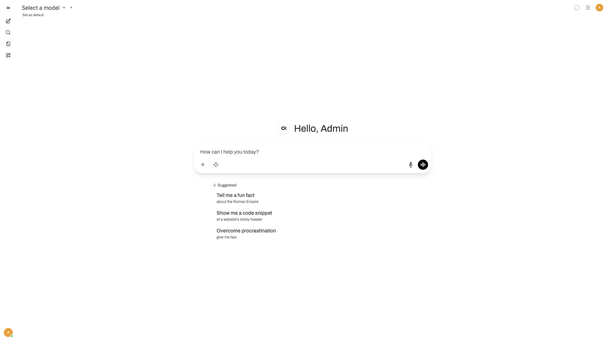

# Open WebUI

Chat UI for multiple LLM providers over an OpenAI-compatible API. Supports
conversation history, model management, RAG, and web search, backed by a built-in
SQLite database.



## Usage

```bash
make docker-up
```

Open [`http://localhost:8080`](http://localhost:8080). With `WEBUI_AUTH=true`
the **first account you create becomes the admin**. Add provider keys via `.env`
(`OPENAI_API_BASE_URL` / `OPENAI_API_KEY`) or in Settings → Connections.

> Ollama is disabled (`ENABLE_OLLAMA_API=false`); this instance uses external
> OpenAI-compatible providers only. Dismiss the "What's New" modal shown on
> first login.

## Services

| Container | Port(s) | Description |
|-----------|---------|-------------|
| **open-webui** | `8080` | Open WebUI web application with built-in SQLite database |

## Configuration

Environment variables in `.env`:

| Variable | Default | Notes |
|----------|---------|-------|
| `OPENAI_API_BASE_URL` | `https://api.openai.com/v1` | LLM provider endpoint |
| `OPENAI_API_KEY` | — | Provider key; **change** — required for chat |
| `WEBUI_AUTH` | `true` | Enable authentication (first account = admin) |
| `ENABLE_OLLAMA_API` | `false` | Connect to a local Ollama instance |

## Volumes

| Path | Contents |
|------|----------|
| `.docker/data/` | Accounts, settings, conversation history, RAG data (SQLite + files) |

## Observability

| Check | Endpoint / Command |
|-------|--------------------|
| Reachable | `curl -I http://localhost:8080/` |
| Logs | `docker compose logs -f open-webui` |

## Resources

- GitHub: https://github.com/open-webui/open-webui
- Docs: https://docs.openwebui.com
