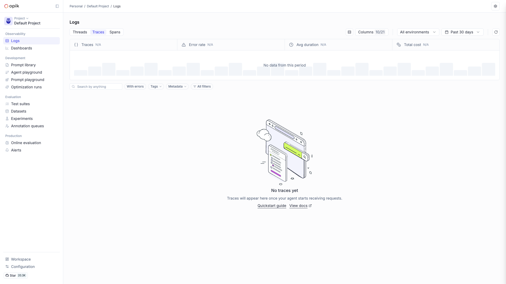

# Comet Opik

Open-source LLM observability and evaluation platform — tracing, experiments,
prompt versioning, LLM-as-judge evals, and CI/CD integration. Multi-service
stack (Java backend, Python evaluator, MySQL, ClickHouse, ZooKeeper, Redis,
MinIO) behind an Nginx frontend.



## Usage

```bash
make docker-up      # or: docker compose up -d
```

Open [`http://localhost:5173`](http://localhost:5173) — no login required by
default. The frontend Nginx proxies `/api` to the backend.

> **First boot takes 2–3 minutes.** The Java backend runs Liquibase (MySQL) +
> ClickHouse migrations before it reports healthy, and every service is ordered
> by healthchecks (`docker compose ps` should show all `healthy`). ClickHouse
> mounts `clickhouse-macros.xml` to supply the `macros`/`zookeeper`/
> `remote_servers` cluster definitions the migrations need for
> `ReplicatedMergeTree` + `ON CLUSTER` DDL — without it the backend never
> becomes healthy.

> **Security note.** `python-backend` mounts the host Docker socket
> (`/var/run/docker.sock`) so it can spawn ephemeral executor containers for
> user-supplied eval code. A Docker-socket mount is host-root-equivalent — only
> run this on trusted local machines.

<details><summary>API examples</summary>

Python SDK:

```python
pip install opik
import opik
opik.configure(use_local=True)  # points to http://localhost:5173

from opik.integrations.openai import track_openai
from openai import OpenAI

client = track_openai(OpenAI())
client.chat.completions.create(model="gpt-4o",
    messages=[{"role": "user", "content": "Hello"}])
```

LangChain:

```python
from opik.integrations.langchain import OpikTracer
tracer = OpikTracer()
chain.invoke({"input": "..."}, config={"callbacks": [tracer]})
```

</details>

## Services

| Container | Port(s) | Description |
|-----------|---------|-------------|
| **frontend** | `5173` | Nginx web UI, proxies `/api` to the backend |
| **backend** | — | Java (Spring Boot) API server; runs MySQL + ClickHouse migrations |
| **python-backend** | — | Python evaluation service (mounts Docker socket to run eval code) |
| **mysql** | — | MySQL 8 relational/metadata store |
| **clickhouse** | — | ClickHouse trace/span analytics |
| **zookeeper** | — | ClickHouse coordination |
| **redis** | — | Cache / session store |
| **minio** | `127.0.0.1:9001` (console) | S3-compatible object storage |
| **mc** | — | One-time MinIO bucket initializer |

## Configuration

Environment variables (compose defaults, overridable via `.env`):

| Variable | Default | Notes |
|----------|---------|-------|
| `MYSQL_PASSWORD` | `opik` | MySQL user password; **change** for real use |
| `CLICKHOUSE_PASSWORD` | `opik` | ClickHouse password; **change** for real use |
| `REDIS_PASSWORD` | `opik` | Redis password; **change** for real use |
| `MINIO_ROOT_USER` | `opik-access-key` | MinIO access key; **change** for real use |
| `MINIO_ROOT_PASSWORD` | `opik-secret-key` | MinIO secret key; **change** for real use |

## Volumes

| Path | Contents |
|------|----------|
| `.docker/mysql/` | MySQL data |
| `.docker/clickhouse/` | ClickHouse data |
| `.docker/zookeeper/` | ZooKeeper data |
| `.docker/redis/` | Redis persistence |
| `.docker/minio/` | MinIO object storage |

## Observability

| Check | Endpoint / Command |
|-------|--------------------|
| Frontend health | `curl http://localhost:5173/health` |
| Service status | `docker compose ps` (expect all `healthy`) |
| Logs | `docker compose logs -f frontend` |

## Resources

- GitHub: https://github.com/comet-ml/opik
- Docs: https://www.comet.com/docs/opik/
