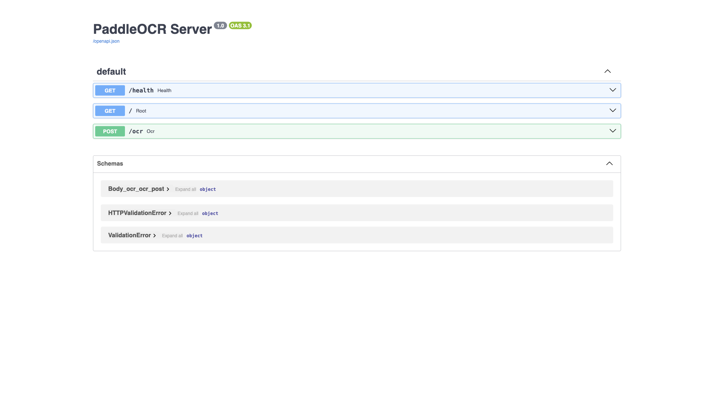

# PaddleOCR

OCR REST API supporting 80+ languages, powered by PaddlePaddle. Custom local
build wrapping PaddleOCR in a FastAPI server. API-only — there is no web
dashboard; the human-facing surface is the auto-generated Swagger UI at `/docs`.



## Usage

This is a local `build:` stack — the image must be built before the first run:

```bash
make docker-up
# or, to force a rebuild:
docker compose up -d --build
```

Verify (the server binds `0.0.0.0:8866`):

```bash
curl -s http://localhost:8866/          # {"service":"paddleocr","docs":"/docs"}
curl -s http://localhost:8866/health    # {"status":"ok"}
open http://localhost:8866/docs          # interactive Swagger UI
```

> **Large, slow first build.** `pip install paddlepaddle paddleocr` pulls a
> heavy dependency chain — allow several minutes on the first build (cached
> afterwards). Model files are downloaded lazily on the **first** `POST /ocr`
> request, so that first OCR call is slower than later ones. The unpinned
> wheels run cleanly on arm64 under OrbStack; if a future wheel drops arm64,
> add `platform: linux/amd64` to the service.

<details><summary>API examples</summary>

```bash
# Multipart file upload (not base64 JSON)
curl -X POST http://localhost:8866/ocr -F "file=@image.png"
# → {"lines":[{"text":"...","confidence":0.99,"box":[...]}], "text":"..."}
```

- `POST /ocr` — upload an image, returns text lines with confidence + bounding boxes
- `GET /health` — health check
- `GET /docs` — Swagger UI

</details>

## Services

| Container | Port(s) | Description |
|-----------|---------|-------------|
| **paddleocr** | `8866` | PaddleOCR REST API (FastAPI), custom local build |

## Configuration

No `.env` — no configurable environment variables. No sandbox secrets.

## Volumes

None — stateless. Model files are cached inside the container and re-downloaded
on a fresh build.

## Observability

| Check | Endpoint / Command |
|-------|--------------------|
| Health | `curl http://localhost:8866/health` |
| API docs | `http://localhost:8866/docs` |
| Logs | `docker compose logs -f paddleocr` |

## Resources

- GitHub: https://github.com/PaddlePaddle/PaddleOCR
