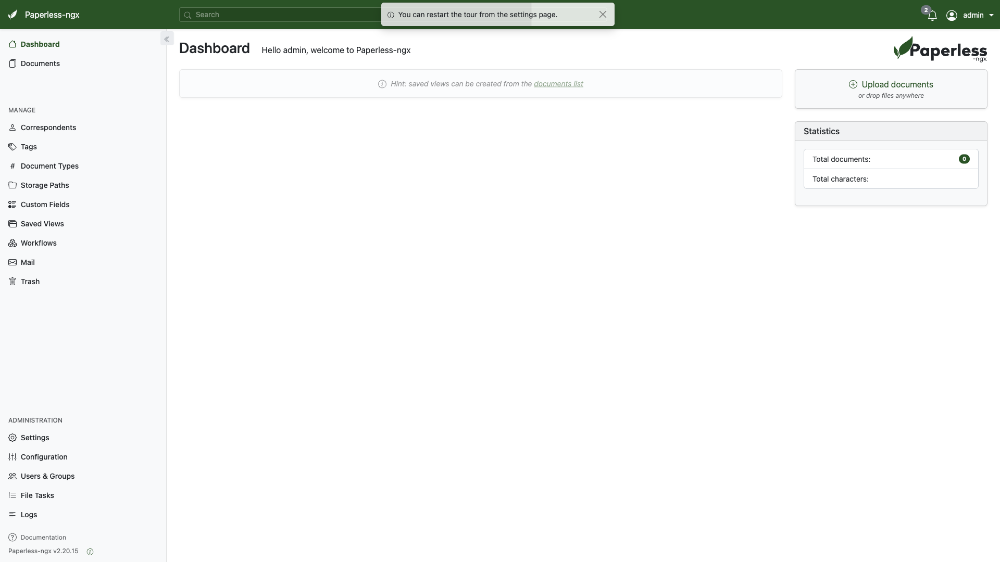

# Paperless-NGX

Document management system with automatic OCR, tagging, and full-text search.
Bundles Apache Tika (content extraction) and Gotenberg (PDF conversion) alongside
PostgreSQL and a Valkey broker for a complete document-processing pipeline.



## Usage

```bash
make docker-up      # or: docker compose up -d
```

Open [`http://localhost:8000`](http://localhost:8000) and log in with the
sandbox admin credentials `admin` / `admin` (`PAPERLESS_ADMIN_USER` /
`PAPERLESS_ADMIN_PASSWORD`). Drop files into `.docker/consume/` for auto-import.

> First boot is slow (~1–2 min): the app runs database migrations and creates
> the superuser before the web UI answers. `paperless` waits on the `db` and
> `broker` healthchecks (`depends_on: condition: service_healthy`). Tika and
> Gotenberg are bundled in this stack and wired via `PAPERLESS_TIKA_ENABLED=1`.
> `curl http://localhost:8000` returns a `302` redirect to `/accounts/login/`
> once ready.

## Services

| Container | Port(s) | Description |
|-----------|---------|-------------|
| **paperless** | `8000` | Paperless-NGX web application |
| **db** | — | PostgreSQL 16 database |
| **broker** | — | Valkey (Redis-compatible) task broker |
| **tika** | — | Apache Tika content extraction |
| **gotenberg** | — | Gotenberg PDF conversion |

## Configuration

Environment variables in `docker-compose.yml` (sandbox-safe defaults):

| Variable | Default | Notes |
|----------|---------|-------|
| `PAPERLESS_ADMIN_USER` | `admin` | Admin username |
| `PAPERLESS_ADMIN_PASSWORD` | `admin` | Admin password; **change** for real use |
| `PAPERLESS_SECRET_KEY` | (hardcoded) | Django secret; **change** for real use |
| `PAPERLESS_OCR_LANGUAGE` | `eng` | OCR language |
| `PAPERLESS_TIME_ZONE` | `UTC` | Instance timezone |
| `PAPERLESS_URL` | `http://localhost:8000` | Public URL of the instance |
| `PAPERLESS_DBPASS` | `paperless` | PostgreSQL password; **change** for real use |

## Volumes

| Path | Contents |
|------|----------|
| `.docker/db/` | PostgreSQL data |
| `.docker/media/` | Stored/processed documents |
| `.docker/consume/` | Drop-folder for auto-import |
| `.docker/export/` | Document exports |

## Observability

| Check | Endpoint / Command |
|-------|--------------------|
| Reachable | `curl -I http://localhost:8000` (302 → `/accounts/login/` when ready) |
| Logs | `docker compose logs -f paperless` |

## Resources

- GitHub: https://github.com/paperless-ngx/paperless-ngx
- Docs: https://docs.paperless-ngx.com
