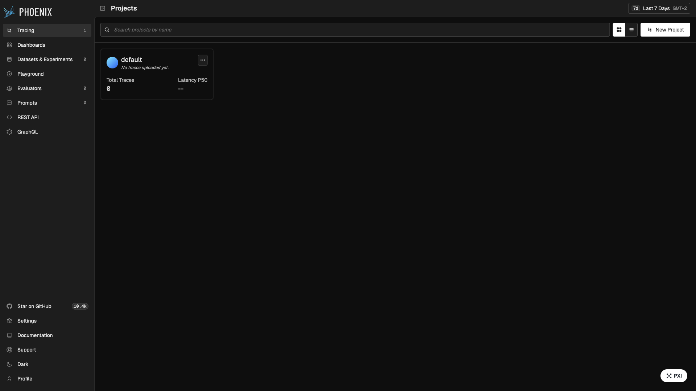

# Phoenix

Open-source LLM observability platform by Arize — tracing, evals, and a UI for
inspecting LLM application runs via OpenTelemetry. Traces are received over OTLP
and stored in PostgreSQL.



## Usage

```bash
make docker-up
```

Open the UI at http://localhost:6006. Point your app's OTLP exporter at
`http://localhost:4317` (gRPC) and traces appear under the matching project.

> The dashboard opens with **no authentication** by default — `PHOENIX_ENABLE_AUTH`
> is not set. The `PHOENIX_DEFAULT_ADMIN_INITIAL_PASSWORD` seed (`admin`) only
> applies once you set `PHOENIX_ENABLE_AUTH=true` (plus a `PHOENIX_SECRET`), after
> which you log in as `admin@localhost` with that password.

<details><summary>Sending traces</summary>

Install the SDK in your Python project:

```bash
pip install arize-phoenix-otel opentelemetry-sdk
```

Register a tracer provider:

```python
from phoenix.otel import register

tracer_provider = register(
    project_name="my-project",
    endpoint="http://localhost:4317",
)
```

Or use the standard OTLP exporter:

```bash
OTEL_EXPORTER_OTLP_ENDPOINT=http://localhost:4317
OTEL_EXPORTER_OTLP_PROTOCOL=grpc
```

</details>

## Services

| Container | Port(s) | Description |
|-----------|---------|-------------|
| **phoenix** | `6006`, `4317` | Phoenix server + web UI (`6006`) and OTLP gRPC collector (`4317`) |
| **db** | — | PostgreSQL 16 backing store for trace data |

## Configuration

Environment variables in `.env` (sandbox-safe defaults):

| Variable | Default | Notes |
|----------|---------|-------|
| `POSTGRES_PASSWORD` | `phoenix` | Postgres password; **change** for real use |
| `PHOENIX_ADMIN_PASSWORD` | `admin` | Seeds the initial admin password (only used once auth is enabled) |
| `PHOENIX_TELEMETRY_ENABLED` | `false` | Upstream product telemetry |
| `PHOENIX_WORKING_DIR` | `/mnt/data` | Container path for persisted working data |

## Volumes

| Path | Contents |
|------|----------|
| `.docker/phoenix/` | Phoenix working directory |
| `.docker/postgres/` | PostgreSQL data (trace store) |

## Observability

| Check | Endpoint / Command |
|-------|--------------------|
| Health | `curl http://localhost:6006/healthz` |
| Logs | `docker compose logs -f phoenix` |

## Resources

- GitHub: https://github.com/Arize-ai/phoenix
- Docs: https://arize.com/docs/phoenix
