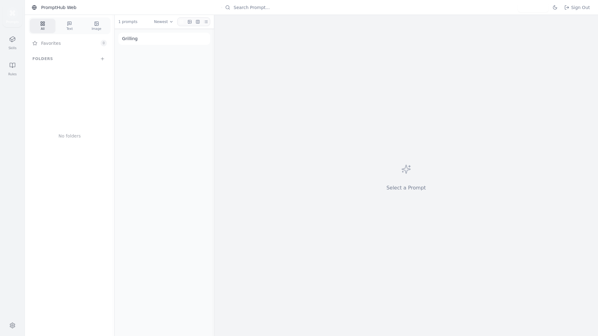

# PromptHub (web self-hosted)

Self-hosted web edition of [PromptHub](https://github.com/legeling/PromptHub) —
an all-in-one AI toolbox for **prompt / skill / agent** management with
import/export, sync, media and versioning. This is `apps/web`, the lightweight
single-instance edition (local-first, SQLite index + workspace files on disk),
**not** the hosted PromptHub Cloud SaaS.

Uses the pre-built `ghcr.io/legeling/prompthub-web:latest` image; based on the
upstream [`apps/web/docker-compose.yml`](https://github.com/legeling/PromptHub/blob/main/apps/web/docker-compose.yml)
and [self-hosting docs](https://github.com/legeling/PromptHub/blob/main/docs/web-self-hosted.md).



## Services

- **prompthub-web**: PromptHub web server (Node) with an embedded SQLite database

## Ports

- `3871`: web UI and API (container port `3000`; override with `PROMPTHUB_WEB_PORT`)

## Usage

```bash
make docker-up
```

Then open http://localhost:3871.

### First-run setup

On first visit with an empty database the app redirects to **`/setup`**, where
you create the initial **administrator** account. After that, public
registration stays disabled (`ALLOW_REGISTRATION=false`) and subsequent visits
go to the normal login page.

## Sandbox defaults

- **Registration closed.** `ALLOW_REGISTRATION=false`; the single admin is
  created only through `/setup` (the first account is allowed even with
  registration off, then registration stays closed).
- **Sandbox `JWT_SECRET`.** A placeholder (>=32 chars) is baked in — override
  it for anything but local use.
- **`AUTH_CAPTCHA_ENABLED=false` is set but only takes effect on >= 0.5.9.**
  The current `:latest` image (v0.5.8) **always** shows an image captcha on
  `/setup` and `/login` regardless of this flag — the disable switch landed
  after 0.5.8. It's set here so captcha auto-disables once you bump the image
  to a release that honours it. Login/setup comparison is case-insensitive and
  the charset excludes `0 o 1 i I l`.

## Configuration

| Variable | Description | Default |
|----------|-------------|---------|
| `PROMPTHUB_WEB_PORT` | Host port | `3871` |
| `JWT_SECRET` | JWT signing secret (**>=32 chars**) | sandbox placeholder |
| `ALLOW_REGISTRATION` | Allow public sign-up (keep off; use `/setup`) | `false` |
| `AUTH_CAPTCHA_ENABLED` | Image captcha on setup/login (only honoured on >= 0.5.9; v0.5.8 always on) | `false` |
| `TRUST_PROXY_HEADERS` | Trust `X-Forwarded-*` (only behind a sanitizing proxy) | `false` |

Generate a real secret for non-local use:

```bash
export JWT_SECRET=$(openssl rand -base64 48)
docker compose up -d
```

## Data & persistence

All state lives under `.docker/` (gitignored), mounted into the container's
`DATA_ROOT` (`/app`):

| Path | Contents |
|------|----------|
| `.docker/data/` | SQLite DB (`prompthub.db`) + prompts/skills/assets |
| `.docker/config/` | settings |
| `.docker/logs/` | logs |
| `.docker/backups/` | backups |

Back up the whole set of directories, not just the `.db` file. Reset the
instance by stopping it and deleting `.docker/`.

## Desktop backup target

PromptHub Desktop can use this instance as a personal backup/restore target:
in desktop **Settings → Data**, set the self-hosted URL (`http://localhost:3871`),
username and password.
