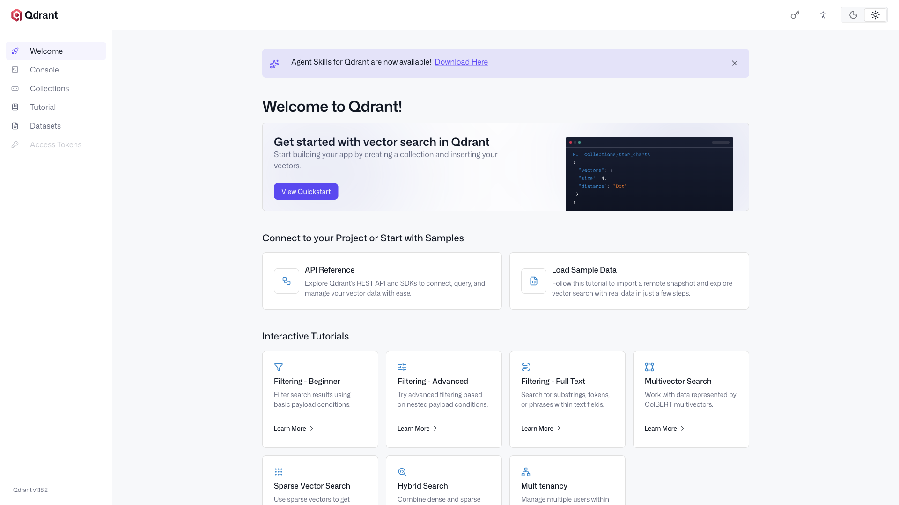

# Qdrant

High-performance vector database for similarity search and AI applications.
Supports metadata filtering, payload storage, and distributed deployment, with a
REST API, gRPC API, and a built-in web dashboard.



## Usage

```bash
make docker-up
```

- REST API: http://localhost:6333
- Web dashboard: http://localhost:6333/dashboard — browse collections, run
  queries, and inspect points.
- gRPC API: `localhost:6334`

No authentication by default (`QDRANT__SERVICE__API_KEY` is commented out in
`docker-compose.yml`).

<details>
<summary>API examples</summary>

Create a collection:

```bash
curl -X PUT http://localhost:6333/collections/my_collection \
    -H "Content-Type: application/json" \
    -d '{"vectors": {"size": 384, "distance": "Cosine"}}'
```

Search vectors:

```bash
curl -X POST http://localhost:6333/collections/my_collection/points/search \
    -H "Content-Type: application/json" \
    -d '{"vector": [0.1, 0.2, ...], "limit": 5}'
```

</details>

## Services

| Container | Port(s) | Description |
|-----------|---------|-------------|
| **qdrant** | `6333` (REST + dashboard), `6334` (gRPC) | Qdrant vector database server |

## Configuration

Environment variables in `docker-compose.yml`:

| Variable | Default | Notes |
|----------|---------|-------|
| `QDRANT__SERVICE__API_KEY` | _(unset)_ | Optional API key for authentication — **set** for anything but local use |

## Volumes

| Path | Contents |
|------|----------|
| `.docker/storage/` | Collections, vectors, and payloads |

## Observability

| Check | Endpoint / Command |
|-------|--------------------|
| Health | `curl http://localhost:6333/healthz` |
| Readiness | `curl http://localhost:6333/readyz` |
| Metrics | `http://localhost:6333/metrics` (Prometheus) |
| Logs | `docker compose logs -f qdrant` |

## Resources

- GitHub: https://github.com/qdrant/qdrant
- Docs: https://qdrant.tech/documentation
